# oh_myssh

一个面向个人开发者和小团队的现代 Web SSH/SFTP 工作区。

它不是把 `ssh` 命令简单塞进网页，也不是另一个沉重的企业堡垒机。项目目标是提供接近 Xshell、MobaXterm 和 Tabby 的工作效率，同时保留 Web 应用的跨平台、可自托管、可离线和易分发能力。

> 当前状态：研究与架构阶段。仓库暂未进入功能开发。

## 我们要做什么

- 现代、流畅的标签页和分屏终端工作区。
- SSH 主机、分组、跳板机、快捷命令和工作区管理。
- 与终端并列的双栏 SFTP 文件管理器。
- 本地优先：断开互联网后仍能管理本机、WSL 和局域网设备。
- 浏览器不保存私钥正文；优先使用系统钥匙串或 `ssh-agent`。
- 同一套会话核心支持本地 Agent 和自托管云端 Gateway。
- 终端引擎可替换，避免被单一渲染器锁死。

## 核心架构

```mermaid
flowchart TB
  subgraph Browser["浏览器工作区"]
    UI["React + TypeScript + Vite PWA<br/>Tabs / Splits / Hosts / SFTP"]
    TERM["TerminalEngine<br/>xterm.js + WebGL 默认<br/>wterm 实验"]
    WASIX["Wasmer WASIX Worker<br/>受限离线 Shell"]
    STORE[("IndexedDB + OPFS")]
    UI --> TERM
    WASIX --> TERM
    STORE --> UI
  end

  subgraph Transport["会话传输"]
    WS["Binary WebSocket<br/>control / terminal / file"]
    FLOW["seq / ACK / backpressure / reconnect"]
    WS --> FLOW
  end

  subgraph Runtime["同一套 Go 会话内核"]
    LOCAL["terminald local<br/>localhost PWA / Keychain / PTY"]
    CLOUD["terminald server<br/>long-lived SSH / SFTP / tunnel"]
  end

  subgraph Targets["目标"]
    SSH["SSH / SFTP Hosts"]
    PTY["ConPTY / WSL / Unix PTY"]
    GUAC["后续：Guacamole<br/>RDP / VNC"]
  end

  UI --> WS
  TERM --> WS
  FLOW --> LOCAL
  FLOW --> CLOUD
  LOCAL --> SSH
  LOCAL --> PTY
  CLOUD --> SSH
  CLOUD -.-> GUAC
```

这不是“React 还是 WASM”的二选一：

- React 负责产品工作区。
- xterm.js + WebGL 负责第一版生产终端。
- wterm/Ghostty WASM 放在适配层后验证。
- Wasmer WASIX 只承担浏览器内受限离线 Shell。
- 真实 SSH/SFTP、PTY、密钥和端口转发由长驻的 Go 服务处理。

## 第一版范围

首个可用版本只聚焦：

1. 本地 Agent 单文件运行。
2. SSH 密码、密钥、`ssh-agent` 和 host key 校验。
3. 标签页、分屏、主机分组和快捷连接。
4. 双栏 SFTP、上传下载、进度和取消。
5. 命令片段和工作区恢复。
6. 无互联网环境下从 `localhost` 完整启动。

RDP/VNC、串口、Telnet、团队 PAM、审计平台和 AI 助手暂不进入第一个 MVP。

## 文档

- [开源项目研究与复用决策](docs/OPEN_SOURCE_RESEARCH.md)
- [产品架构、协议与路线图](docs/ARCHITECTURE_AND_ROADMAP.md)

## 当前关键决策

- 不 fork 某个大型现有产品，采用绿地架构并复用成熟基础库。
- 默认终端引擎选择 xterm.js/WebGL，wterm 作为实验实现。
- 优先交付本地 Agent，而不是先建复杂 SaaS。
- React 状态层不承载终端字节流。
- Vercel/CDN 可以承载静态 PWA 和轻量控制面，但长期 SSH 会话必须运行在长驻服务中。
- 私钥默认不进入浏览器、IndexedDB、OPFS、日志和会话录屏。

## License

项目许可证尚未确定。在许可证正式落地前，不接受复制自其他项目的代码。

建议在开始功能开发前，从以下策略中明确选择：

- `Apache-2.0`：更利于采用、集成和开放核心商业模式。
- `AGPL-3.0`：更强调托管服务修改也需要开放源码。

无论选择哪一种，都不能直接混入与目标许可证不兼容的第三方代码。
