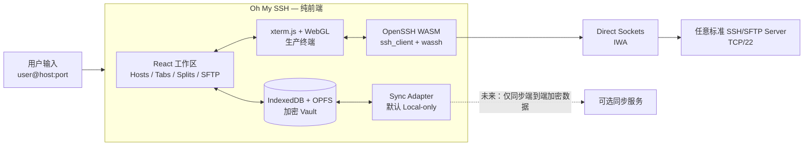

# Oh My SSH

> WebSSH 的直接，Xshell 的连接能力，MobaXterm 的工作区，以及现代 Web 产品的体验。

**Oh My SSH** 是一个本地优先、严格纯前端的 SSH/SFTP 工作区。用户输入任意
`user@host:port`，应用在浏览器进程内运行 OpenSSH WebAssembly，并在支持
Direct Sockets 的 Chromium Isolated Web App（IWA）中直接连接目标 TCP/22。

当前状态：**技术预研与产品定义完成，等待 Phase 0 可行性验证。**

## 不可改变的边界

- 产品运行时只有 HTML、CSS、TypeScript、JavaScript、WebAssembly 和浏览器 API。
- 不包含 Go、Rust、Node.js 或 Python 后端服务。
- 不安装本地 Agent，不依赖项目自建 SSH Gateway。
- SSH、SFTP、私钥解密和终端数据都在用户设备上处理。
- 第一版完全离线可用；未来云同步是可选控制面，不代理 SSH 流量。
- 普通网页没有任意原始 TCP 权限，不能假装能够直接连接标准 SSH 服务。

Node.js、pnpm 和 Vite 只用于构建静态资源，不是产品运行时后端。

## 产品形态



SSH 数据面与云同步控制面永久分离：

```text
SSH/SFTP：浏览器  ──────────────────────>  目标服务器
云同步： 浏览器  <── 端到端加密密文 ──>  可选同步服务
```

云同步服务永远看不到 SSH 密码、私钥明文、终端内容，也不参与 SSH 连接。

## 发行矩阵

| 形态 | 真实 SSH | 是否需要 Relay | 用途 |
|---|---:|---:|---|
| Chromium IWA + Direct Sockets | 是，直连 TCP/22 | 否 | 主产品 |
| 普通静态 PWA | 浏览器不能直连 TCP/22 | 是 | 离线工作区、演示和可选兼容 |
| 用户显式配置第三方 Relay | 是 | 是 | 兼容模式，不是默认架构 |
| Wasmer WASIX 离线 Shell | 不是远程 SSH | 否 | 后续实验能力 |

IWA/Direct Sockets 目前仍有生产分发和 allowlist 限制。这是项目的首要风险，
必须在制作完整 UI 前用真实安装包和真实 SSH 服务完成验证。

## 锁定的技术路线

| 层 | 选择 | 原因 |
|---|---|---|
| 产品 UI | React 19 + TypeScript strict + Vite 8 | 成熟、快速、适合复杂桌面工作区 |
| 样式系统 | Tailwind CSS 4 + CSS variables + Radix Primitives | 高密度、一致、可访问且容易主题化 |
| 字体 | 本地打包 Geist Sans；终端使用 Geist Mono 与系统 CJK fallback | 精确、现代，不产生远程字体请求 |
| 终端 | xterm.js 6 + WebGL | 首版可靠性、Unicode、IME 和吞吐优先 |
| 实验终端 | wterm/Ghostty WASM adapter | 验证未来渲染器，不阻塞生产版本 |
| SSH | Chromium `ssh_client` + `wassh` + `wasi-js-bindings` | 复用真正的 OpenSSH WASM，不重写 SSH 协议 |
| Socket | `SocketTransport` adapter | 隔离 Direct Sockets、兼容模式和能力检测 |
| SFTP | 优先适配 Chromium `nasftp` | 使用结构化协议，不解析 CLI 文本 |
| 状态 | Zustand 只保存低频 UI 状态 | 终端字节和文件数据不进入 React 状态 |
| 存储 | IndexedDB/Dexie + OPFS | 元数据事务与大文件流分离 |
| Vault | Argon2id WASM + WebCrypto AES-256-GCM | 本地加密、版本化参数和逐记录认证加密 |
| 并发 | Web Workers + Streams + transferable/SAB | SSH、SFTP、KDF 不阻塞主线程 |
| 工程 | pnpm workspace + Biome + Vitest + Playwright | 快速、一致、可自动验证 |

依赖版本会锁定在 lockfile 中；表中的主版本是 2026-07-23 的技术基线，
不是允许自动漂移的范围。

## 第一版能力

- 任意主机快速连接：hostname、port、username。
- 密码、Ed25519、RSA 和加密私钥。
- 首次 host key 指纹确认，变化时 fail closed。
- 主机收藏、分组、搜索、标签、ProxyJump 数据模型。
- 标签、多层分屏、布局保存、快捷键和命令面板。
- xterm.js/WebGL、CJK、IME、emoji、tmux、vim、鼠标和 bracketed paste。
- 双栏 SFTP、流式上传/下载、取消、覆盖确认和传输队列。
- 命令片段、历史搜索和多会话广播的安全确认。
- 浏览器加密 Vault、自动锁定、恢复包和显式导入/导出。
- IWA 离线安装、签名更新、能力诊断和崩溃恢复。

第一版不做 RDP/VNC、企业 PAM、团队审计、本机 PTY/WSL、AI 助手或官方
SSH Relay。

## 性能原则

- 终端字节永不进入 React props、Context、Zustand 或普通日志。
- OpenSSH、SFTP、Argon2id 和离线 WASIX 分别运行在 Worker。
- xterm.js 使用 WebGL；输出按帧批处理并由写入回调提供背压。
- cross-origin isolated 时使用 SharedArrayBuffer ring buffer，否则使用
  transferable `ArrayBuffer`。
- 隐藏会话停止绘制但继续有界消费网络数据。
- SFTP 全程使用 Streams/OPFS，大文件不完整装入内存。
- 所有性能结论必须由固定 ANSI replay、真实 SSH 和大文件传输基准证明。

详细预算见[性能工程与验收基线](docs/PERFORMANCE_ENGINEERING.md)。

## 路线图

1. **Phase 0 / 生死验证**：IWA `TCPSocket` → TCP/22 → OpenSSH WASM →
   xterm.js，真实服务器登录成功。
2. **Phase 1 / SSH Core**：认证、host key、Vault、连接生命周期和错误模型。
3. **Phase 2 / Workspace**：主机树、标签、分屏、快捷命令和布局恢复。
4. **Phase 3 / SFTP 与发布**：流式文件管理、签名 IWA、CSP、SBOM。
5. **Phase 4 / Public Beta**：兼容矩阵、诊断、性能回归和恢复流程。
6. **Phase 5 / 可选云同步**：端到端加密 profiles/settings；密钥同步单独授权。
7. **Phase 6 / 扩展**：ProxyJump、端口转发、WebAuthn PRF、wterm/WASIX 实验。

任何完整 UI 开发都不能绕过 Phase 0。若目标用户无法安装 IWA，或
`ssh_client/wassh` 无法稳定接入 Direct Sockets，必须先重新评估产品分发，
而不是用宣传文案掩盖平台限制。

## 文档

- [产品蓝图与体验规范](docs/PRODUCT_BLUEPRINT.md)
- [纯前端架构、平台边界与路线图](docs/ARCHITECTURE_AND_ROADMAP.md)
- [性能工程与验收基线](docs/PERFORMANCE_ENGINEERING.md)
- [本地 Vault、端到端加密同步与安全边界](docs/SYNC_AND_SECURITY.md)
- [开源项目研究与复用决策](docs/OPEN_SOURCE_RESEARCH.md)

## 许可证

项目许可证尚未由仓库所有者最终确认。建议采用 Apache-2.0，并在开始复制或
改造第三方代码前建立 `THIRD_PARTY_NOTICES.md`、SBOM 和依赖来源锁定。
Chromium libapps 为 BSD-3-Clause，xterm.js 为 MIT，wterm 为 Apache-2.0。
