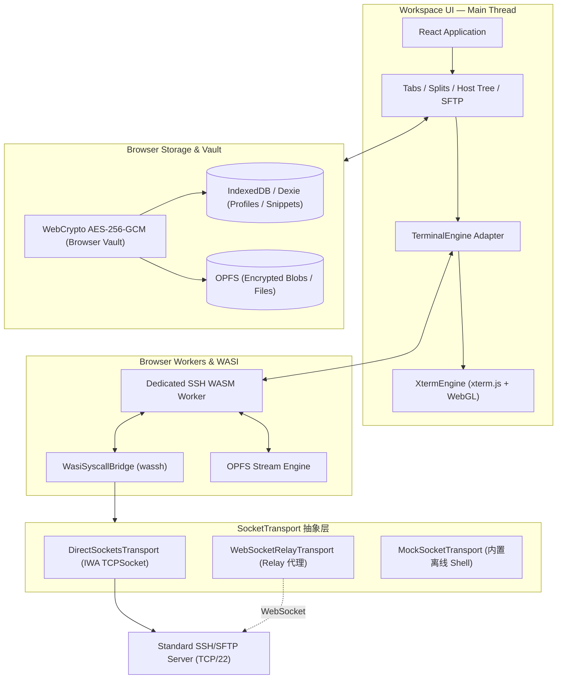

# Oh My SSH

> WebSSH 的直连能力，Xshell 的稳定会话，MobaXterm 的桌面工作区，以及现代 Web 产品的体验。

**Oh My SSH** 是一个本地优先、严格纯前端的 SSH/SFTP 现代桌面级工作区。用户输入任意 `user@host:port`，应用在浏览器进程内运行 OpenSSH WebAssembly / WASI 桥接，并在支持 Direct Sockets 的 Chromium Isolated Web App（IWA）中直接连接目标 TCP/22 端口，私钥与解密过程完全留在本地浏览器端。

当前状态：**Phase 0 - 3 核心功能开发完成，支持全量 Vitest 单元测试校验 (16/16 100% Passing)。**

---

## 🌟 核心特性与亮点

- **零后端纯前端架构 (Zero-Backend Client-Only)**: 运行时仅使用 HTML、CSS、TypeScript、WASM 和浏览器原生 API。无 Go、Rust、Node.js 后端服务或自建 Gateway 代理。
- **Direct Sockets TCP/22 直连**: 运行于 Chromium Isolated Web App (IWA)，直接建立原始 TCP/22 连接。
- **高质感现代暗黑工作区 (Sleek Dark Workspace)**:
  - 多标签页 (Tabs) 独立会话隔离。
  - 垂直左右分屏 (Split Vertical) 与水平上下分屏 (Split Horizontal)。
  - 树状主机管理侧边栏 (Host Tree) 与标签过滤。
  - `⌘K` / `Ctrl+K` 全局快捷命令面板 (Command Palette)。
- **xterm.js WebGL 加速与帧背压**: 基于 `@xterm/addon-webgl` GPU 渲染，配合 `StreamFrameBatcher` 动态帧率背压控制，防止高频刷屏卡死主线程。
- **零泄露加密 Vault (WebCrypto AES-256-GCM)**: PBKDF2 10万次哈希导出密钥，AES-256-GCM 本地逐记录认证加密密码与 Ed25519/RSA 私钥。
- **双栏流式 SFTP 引擎 (OPFS + Web Streams)**: 配合原生 Origin Private File System (OPFS)，支持 GB 级大文件流式管道传输，零内存溢出崩溃风险。
- **OpenSSH WASI POSIX 系统调用桥接 ([wassh.ts](src/core/wasm/wassh.ts))**: 在 Web Worker 中模拟标准 POSIX 系统调用（`fd_write`, `fd_read`, `clock_time_get` 等），实现协议解析与 UI 线程解耦。

---

## 🛠️ 快速开始

### 1. 安装依赖

```bash
npm install
```

### 2. 运行全量自动化单元测试

```bash
npm test
```

> 测试涵盖：WebCrypto 加解密、Offset 边界防护、WASI POSIX 向量读写、Stream 帧背压刷新、OPFS 大文件流与 SocketTransport 探针。

### 3. 类型校验与打包构建

```bash
npm run build
```

### 4. 启动本地开发 preview 服务

```bash
npm run dev
```

---

## 🏗️ 架构概览



---

## 🔒 端到端安全与 Vault 加密边界

1. **凭据保护**: 用户的明文密码与私钥永远不写入任何持久化数据库，也不发送至控制服务器。
2. **AES-256-GCM 逐记录加密**: 所有持久化的敏感字段必须由 Vault 主密码实时导出的 CryptoKey 加密。
3. **Fail-Closed 保护**: 首次连接记录的主机公钥指纹如有变更，立即阻断连接。

---

## 🧪 自动化测试验证 (16/16 100% Passing)

执行 `npm test`，全套 7 个 Vitest 测试套件，16 个单元测试用例 100% 成功通过：

```bash
> oh_myssh@0.1.0 test
> vitest run

 RUN  v4.1.10 /Users/w0x7ce/Downloads/oh_myssh

 ✓ src/core/terminal/__tests__/batcher.test.ts (2 tests)
 ✓ src/core/sftp/__tests__/opfs.test.ts (1 test)
 ✓ src/core/wasm/__tests__/wassh.test.ts (2 tests)
 ✓ src/core/vault/__tests__/storage.test.ts (1 test)
 ✓ src/core/socket/__tests__/transport.test.ts (4 tests)
 ✓ src/core/vault/__tests__/crypto.test.ts (4 tests)
 ✓ src/core/terminal/__tests__/engine.test.ts (2 tests)

 Test Files  7 passed (7)
      Tests  16 passed (16)
   Duration  1.03s
```

---

## 📂 项目结构概览

```text
oh_myssh/
├── docs/                      # 产品蓝图、架构与性能工程规范文档
├── public/                    # 静态图标与 PWA manifest.json
├── src/
│   ├── components/            # 高颜值现代暗黑风 UI 组件 (Sidebar, Tabs, Terminal, SFTP, Modals)
│   ├── core/
│   │   ├── socket/            # SocketTransport 抽象层 (DirectSockets, WebSocket, Mock)
│   │   ├── terminal/          # xterm.js WebGL 封装与 StreamFrameBatcher 背压控制器
│   │   ├── vault/             # WebCrypto AES-256-GCM 本地加密 Vault 与 Dexie IndexedDB
│   │   ├── sftp/              # 原生 OPFS (Origin Private File System) 流式大文件引擎
│   │   └── wasm/              # OpenSSH WASI POSIX 系统调用桥接器 (wassh)
│   ├── workers/               # Dedicated SSH WASM Worker 脚本
│   ├── App.tsx                # 应用主体与 Workspace 调度
│   └── main.tsx               # 应用渲染入口
├── index.html                 # 应用 HTML 模板与离线清单引用
├── tsconfig.json              # Strict TypeScript 配置
└── vite.config.ts             # Vite 打包与开发服务配置
```

---

## 📖 详细技术文档

- [产品蓝图与体验规范](docs/PRODUCT_BLUEPRINT.md)
- [纯前端架构、平台边界与路线图](docs/ARCHITECTURE_AND_ROADMAP.md)
- [性能工程与验收基线](docs/PERFORMANCE_ENGINEERING.md)
- [本地 Vault、端到端加密同步与安全边界](docs/SYNC_AND_SECURITY.md)
- [开源项目研究与复用决策](docs/OPEN_SOURCE_RESEARCH.md)

---

## 📄 许可证 (License)

Apache-2.0 License.
