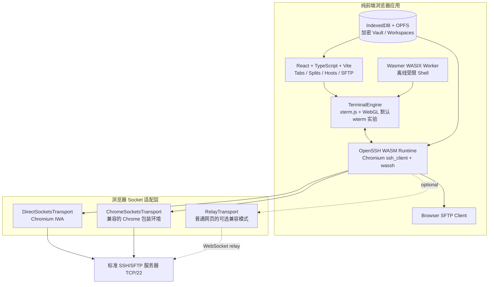

# oh_myssh

一个严格纯前端、浏览器原生的 SSH/SFTP 工作区。

> 不可改变的项目边界：运行时代码只有 HTML、CSS、TypeScript、WebAssembly
> 和浏览器 API；不包含 Go、Node/Python 后端、本地 Agent 或自建 Gateway。

项目希望把 Xshell、MobaXterm 和 Tabby 的工作效率带到浏览器，同时保持
离线安装、静态托管和端侧处理。

当前状态：研究与架构阶段。

## 核心技术路线

这不是用 WASM 模拟 SSH。核心直接使用 OpenSSH 的 WebAssembly 移植：

- Chromium `ssh_client`：OpenSSH 的 WASM/WASI 版本。
- Chromium `wassh`：把 OpenSSH 的 POSIX/WASI 调用桥接到浏览器 API。
- 浏览器 Socket adapter：决定 SSH 字节最终走 Direct Sockets、Chrome
  Sockets，还是用户显式配置的第三方 relay。

## 浏览器能力边界

| 运行形态 | 是否纯前端 | 真实 SSH | 是否需要 Relay |
|---|---:|---:|---:|
| 普通 HTTPS/PWA | 是 | 浏览器不能直接 TCP/22 | 是 |
| Chromium IWA + Direct Sockets | 是 | 可以直接连接标准 SSH | 否 |
| 兼容 Chrome Sockets 的安装包 | 是 | 可以直接连接标准 SSH | 否 |
| WASIX 离线 Shell | 是 | 不是远程 SSH | 否 |

项目的核心目标是 Chromium Isolated Web App（IWA）：

- 静态资源打包为签名 Web Bundle。
- React、OpenSSH WASM、终端和 Vault 全部在本地运行。
- 使用 Direct Sockets 直接连接 TCP/22。
- 不经过我们控制的服务器。
- 普通 PWA 构建仍然保留，但直连 SSH 功能会显示平台不支持。

IWA/Direct Sockets 当前仍存在浏览器分发范围限制，因此它既是项目的关键
技术机会，也是首要产品风险。

## 第一版范围

1. React 工作区、标签页和分屏。
2. xterm.js + WebGL 生产终端。
3. OpenSSH WASM 登录标准 SSH 服务器。
4. 密码和导入私钥认证。
5. host key 指纹确认和 `known_hosts`。
6. 浏览器端加密 Vault。
7. 基础 SFTP 列表、上传、下载和取消。
8. IWA 打包、签名和离线安装。

暂不进入第一版：

- RDP/VNC。
- 企业 PAM、团队 RBAC 和审计平台。
- 操作系统真实 PTY、WSL、PowerShell。
- 系统钥匙串和原生 `ssh-agent`。
- AI 助手。
- 项目自建的 SSH Relay 服务。

## 关键事实

- xterm.js 和 wterm 是终端显示器，不是 SSH 协议实现。
- OpenSSH WASM 才是真正的 SSH 客户端。
- 普通网页没有原始 TCP 权限。
- Direct Sockets 可以提供 TCP/UDP，但仅限高信任的 IWA 环境。
- 浏览器纯前端不能读取操作系统钥匙串；私钥必须由浏览器 Vault 管理。
- Port Forwarding 只在底层 transport 提供真实 socket 能力时可用。

## 文档

- [纯前端开源项目研究与复用决策](docs/OPEN_SOURCE_RESEARCH.md)
- [纯前端架构、平台边界与路线图](docs/ARCHITECTURE_AND_ROADMAP.md)

## License

项目许可证尚未确定。在许可证落地前，不接受复制自其他项目的代码。

目前重点依赖候选包括 BSD-3-Clause 的 Chromium libapps、MIT 的 xterm.js
和 Wasmer JS，以及 Apache-2.0 的 wterm。开始编码前应确定项目许可证并
建立第三方许可证清单。
