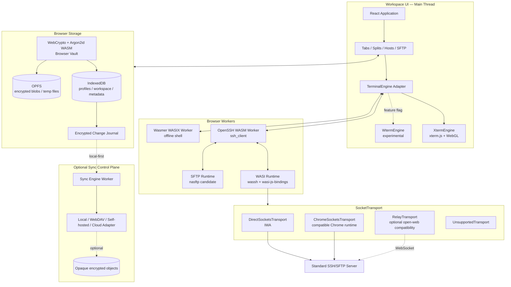
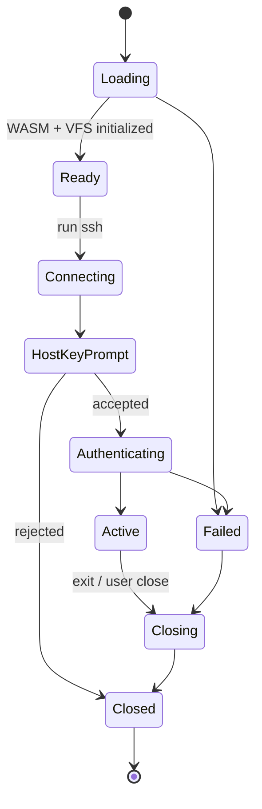

# 纯前端架构、平台边界与路线图

状态：Proposed

日期：2026-07-23

## 1. 不可改变的项目边界

`oh_myssh` 是严格纯前端项目：

- 运行时代码只有 HTML、CSS、TypeScript、JavaScript 和 WebAssembly。
- 不包含 Go、Rust/Node/Python 服务进程。
- 不安装本地 Agent。
- 不要求项目自建 Gateway。
- 不把 SSH 密钥发送到项目控制的服务器。
- 所有工作区、Vault、SSH 和 SFTP 逻辑都在浏览器端执行。
- 未来云同步默认关闭，只交换端到端加密对象，不参与 SSH/SFTP 数据面。

允许的发布形态：

- 普通静态 PWA。
- Chromium Isolated Web App（IWA）。
- 兼容的浏览器扩展/应用包装。

“纯前端”不等于“所有普通网页都拥有原始 TCP 权限”。真实 SSH 是否可以
直连，取决于浏览器宿主是否提供 socket API。

Node.js、pnpm、Vite 和 IWA bundling tool 可以作为构建工具；“无后端”约束的是
产品运行时和连接路径，不是要求开发过程不使用 Node.js。

## 2. 产品定义

目标是一个浏览器中的 Xshell/MobaXterm 类工作区：

- 多标签、多层分屏。
- SSH profiles、分组、跳板机和快捷命令。
- 完整终端体验。
- 双栏 SFTP。
- 浏览器端加密 Vault。
- 完全静态、可离线安装。
- 直接连接标准 SSH server 时不经过项目服务器。
- 后续可选同步加密配置，但本地始终是事实来源。

非目标：

- 企业堡垒机/PAM。
- 浏览器外的真实本机 Shell、PowerShell、WSL 或 PTY。
- RDP/VNC 第一版。
- 项目托管的 SSH Relay。
- AI 优先。

完整产品、视觉和交互规范见
[产品蓝图与体验规范](PRODUCT_BLUEPRINT.md)。

## 3. 总体架构



`OptionalSync` 永远不连接 `SocketLayer`、OpenSSH Worker 或目标服务器。同步模型、
密钥层级和冲突策略见
[本地 Vault、端到端加密同步与安全边界](SYNC_AND_SECURITY.md)。

## 4. 两个完全不同的 WASM Runtime

### 4.1 OpenSSH WASM

用途：真实远程 SSH/SFTP。

参考 Chromium libapps：

```text
OpenSSH source
    ↓ WASI SDK
ssh.wasm / sftp.wasm
    ↓
wassh WASI syscall handlers
    ↓
SocketTransport
```

它负责：

- SSH-2 transport。
- KEX、cipher、MAC。
- host key。
- password/public key authentication。
- channel、exec、shell。
- port forwarding（底层 transport 支持时）。
- OpenSSH 参数和兼容性。

### 4.2 Wasmer WASIX

用途：完全离线的受限本地 Shell。

它负责：

- 浏览器虚拟文件系统。
- WASIX package。
- Python/脚本/文本工具。
- 与远程终端相同的 UI 和快捷键。

它不负责：

- 操作系统真实 PTY。
- PowerShell、WSL 或本机 Bash。
- 绕过浏览器 socket 权限。

这两个 runtime 只共享 TerminalEngine、Vault 的部分文件和工作区 UI，
不强行合并。

## 5. SocketTransport

### 5.1 接口

```ts
export type SocketCapabilities = {
  directTcp: boolean;
  tcpListen: boolean;
  udp: boolean;
  portForwarding: boolean;
  privateNetwork: boolean;
};

export interface DuplexByteStream {
  readable: ReadableStream<Uint8Array>;
  writable: WritableStream<Uint8Array>;
  close(): Promise<void>;
}

export interface SocketTransport {
  readonly name: string;
  probe(): Promise<SocketCapabilities>;
  connect(host: string, port: number): Promise<DuplexByteStream>;
}
```

### 5.2 DirectSocketsTransport

运行环境：Chromium IWA。

```ts
const socket = new TCPSocket(host, port, {
  noDelay: true,
  keepAlive: true,
  keepAliveDelay: 30_000,
});

const { readable, writable } = await socket.opened;
```

能力：

- 直接连接标准 TCP/22。
- 不需要 relay。
- 可以支持本地/远程端口转发。
- 可扩展 UDP 和 mosh 类能力。

前提：

- IWA manifest 显式声明 Direct Sockets permission policy。
- IWA 满足跨源隔离。
- 浏览器/管理员允许该高权限 API。
- 私网访问按平台策略申请必要权限。

### 5.3 ChromeSocketsTransport

运行环境：提供 `chrome.sockets.tcp` 等能力的兼容 Chrome 包装环境。

用途：

- 参考/兼容 Chromium Secure Shell。
- ChromeOS 或受支持的安装环境。

不能假定普通 Manifest V3 扩展在所有桌面平台都能使用这些 API。必须以
运行时探测和官方支持矩阵为准。

### 5.4 RelayTransport

运行环境：普通 HTTPS/PWA。

```text
OpenSSH WASM POSIX socket
      ↓
wassh RelayTransport
      ↓ WebSocket
user-configured relay
      ↓ TCP
SSH server
```

边界：

- `oh_myssh` 不实现、不部署 relay。
- 用户必须显式配置第三方或自己的 relay。
- UI 必须标明流量经过哪个 relay。
- 不能把 relay 模式宣传为端到端零服务。
- Chromium wassh 文档指出 WebSocket relay 不支持完整端口转发。

### 5.5 UnsupportedTransport

当环境没有 Direct Sockets、Chrome Sockets，也没有用户配置 relay：

- SSH 按钮显示“当前浏览器不能直接连接 TCP/22”。
- 不伪装连接。
- WASIX 离线 Shell 和工作区仍可使用。
- 提供 IWA 安装说明。

### 5.6 能力选择

```ts
async function selectTransport(): Promise<SocketTransport> {
  if (await directSockets.probe()) return directSockets;
  if (await chromeSockets.probe()) return chromeSockets;
  if (relayConfig.isComplete()) return relayTransport;
  return unsupportedTransport;
}
```

不能只判断全局对象存在。`probe()` 必须验证 permission、实际 open 结果和
目标网络范围。

## 6. OpenSSH WASM Runtime

### 6.1 模块

```text
packages/ssh-runtime/
  src/
    OpenSshRuntime.ts
    OpenSshProcess.ts
    StdioBridge.ts
    FileSystemBridge.ts
    SocketSyscallBridge.ts
    HostKeyEvents.ts
    AuthEvents.ts
  worker/
    ssh.worker.ts
  wasm/
    ssh.wasm
    sftp.wasm
```

### 6.2 生命周期



### 6.3 stdio bridge

输入：

```text
xterm.onData()
  -> UTF-8/binary input
  -> worker ring buffer
  -> OpenSSH stdin
```

输出：

```text
OpenSSH stdout/stderr
  -> worker ring buffer
  -> TerminalEngine.write(Uint8Array)
```

要求：

- 不把 terminal bytes 放入 React state。
- 使用 transferable `ArrayBuffer` 或 SharedArrayBuffer ring。
- 输出队列有 high/low water mark。
- UI 卡顿时暂停 worker 到 main 的 pump。
- stderr 中的认证/host key 事件尽量通过结构化 hook，不依赖脆弱文本解析。

### 6.4 虚拟文件系统

OpenSSH WASM 需要虚拟 `$HOME`：

```text
/home/web/
  .ssh/
    config
    known_hosts
    identities/
  downloads/
  uploads/
```

持久化规则：

- `.ssh/config` 可以从 profile 生成，不把 UI model 等同于文本文件。
- `known_hosts` 加密保存。
- 私钥解锁后只挂载到临时内存文件系统。
- Worker 结束时销毁临时身份文件。
- 导入/导出必须通过显式用户操作。

## 7. TerminalEngine

```ts
export interface TerminalEngine {
  mount(container: HTMLElement): Promise<void>;
  write(data: Uint8Array): void;
  onInput(handler: (data: Uint8Array) => void): () => void;
  resize(cols: number, rows: number): void;
  focus(): void;
  serialize?(): Uint8Array;
  dispose(): void;
}
```

实现：

- `XtermEngine`：默认。
- `WtermEngine`：实验。
- `ReplayEngine`：回放/测试。

### xterm.js 配置

首版 addons：

- WebGL。
- fit。
- search。
- serialize。
- unicode11。
- clipboard。

后续：

- image。
- web links。
- ligatures。
- experimental unicode-graphemes。

### wterm 晋级门槛

- CJK/IME 无多余字符。
- emoji/双宽字符网格正确。
- tmux、vim、htop。
- mouse tracking。
- alternate screen。
- resize/scrollback。
- box drawing。
- 长时间输出。

任何一项失败都保持实验状态。

## 8. SFTP Runtime

### 8.1 API

```ts
export interface SftpClient {
  list(path: string): Promise<RemoteEntry[]>;
  stat(path: string): Promise<RemoteStat>;
  realpath(path: string): Promise<string>;
  mkdir(path: string): Promise<void>;
  rename(from: string, to: string): Promise<void>;
  remove(path: string, recursive?: boolean): Promise<void>;
  chmod(path: string, mode: number): Promise<void>;
  download(
    remotePath: string,
    sink: WritableStream<Uint8Array>,
    signal?: AbortSignal,
  ): Promise<void>;
  upload(
    source: ReadableStream<Uint8Array>,
    remotePath: string,
    signal?: AbortSignal,
  ): Promise<void>;
}
```

### 8.2 实现顺序

1. 验证 Chromium `nasftp` 可独立复用程度。
2. 将其 transport/VFS 与 UI 解耦。
3. 保留 `SftpClient` 接口。
4. 如果耦合不可接受，抽取独立 protocol core。

禁止把 `sftp` CLI 的人类文本输出解析为正式 API。

### 8.3 文件流

下载：

```text
SFTP packets
  -> worker
  -> OPFS temporary file / File System Access sink
  -> progress events
```

上传：

```text
File / OPFS
  -> ReadableStream
  -> SFTP worker
  -> SSH socket
```

要求：

- 大文件不完整装入内存。
- 进度事件限频。
- terminal 和 transfer 使用不同 SSH channel。
- 支持 `AbortSignal`。
- 断点续传第二阶段实现。

## 9. Browser Vault

纯前端不能读取系统 Keychain，因此 Vault 是核心安全组件。

### 9.1 加密结构

```text
User password
  -> Argon2id WASM
  -> Key Encryption Key
  -> unwrap Vault Master Key
  -> AES-GCM per-record encryption
```

记录：

```ts
type EncryptedRecord = {
  id: string;
  version: 1;
  algorithm: "AES-GCM";
  nonce: Uint8Array;
  ciphertext: Uint8Array;
  aad: Uint8Array;
};
```

规则：

- 每条记录使用独立随机 nonce。
- AAD 绑定 record id、类型和 schema version。
- Argon2 参数写入 Vault header，允许未来升级。
- Vault Master Key 随机生成，不直接等于密码派生值。
- 解锁 key 以 non-extractable `CryptoKey` 或最小生命周期字节存在。
- 私钥默认不导出。
- 自动锁定后销毁 Worker 和已解密 VFS。

### 9.2 可选 WebAuthn PRF

后续可以使用 WebAuthn PRF 派生设备绑定的解锁材料。

仍需保留：

- 恢复密码或导出恢复包。
- 浏览器不支持时的主密码路径。
- 用户明确知道删除浏览器 profile 会丢失本地数据。

### 9.3 不能承诺

- JS GC 下绝对可靠的内存清零。
- 抵御已控制浏览器/恶意扩展。
- 与硬件安全模块相同的密钥保护等级。

必须通过签名 IWA、严格 CSP、无远程脚本和依赖审计降低风险。

## 10. 数据模型

```text
HostProfile
  id, name, hostname, port, username
  groupId, identityId, proxyJumpIds[]
  sshOptions, tags[]

Identity
  id, name, kind
  encryptedPrivateKeyRef
  publicKey, fingerprint

KnownHost
  host, port, algorithm, fingerprint
  encryptedLine, acceptedAt

Workspace
  id, name, layoutTree, tabs[], updatedAt

Snippet
  id, name, command, tags[], scope

TransferTask
  id, sessionId, direction
  source, destination
  bytesDone, bytesTotal, state

AppCapabilitySnapshot
  directSockets, chromeSockets, relay
  webgl, opfs, sharedArrayBuffer, webauthnPrf
```

IndexedDB：

- profile/workspace/snippet metadata。
- 加密 Vault records。
- capability snapshot。
- encrypted change journal、tombstones 和 sync cursor。

OPFS：

- 加密私钥 blob。
- 大文件临时区。
- 录屏。
- WASM runtime cache。
- 可恢复上传片段。

## 11. IWA 打包

### 11.1 Manifest

核心字段：

```json
{
  "name": "oh_myssh",
  "version": "0.1.0",
  "start_url": "/",
  "display": "standalone",
  "permissions_policy": {
    "direct-sockets": ["self"],
    "cross-origin-isolated": ["self"]
  }
}
```

实际字段以目标 Chrome/IWA 版本官方文档为准。

访问 RFC1918/private 或 loopback 地址还受额外网络权限控制。Direct Sockets
spec 使用 `local-network`/`loopback-network` policy-controlled feature，
Chrome 文档在部分场景使用 `direct-sockets-private`。Phase 0 必须针对锁定的
Chrome 版本验证真实 manifest 字段和授权 UI，不能假定 `direct-sockets` 自动允许
局域网与本机地址。

### 11.2 构建

```text
pnpm build
  -> dist/
  -> unsigned Web Bundle
  -> Ed25519/ECDSA signed .swbn
  -> update manifest
```

签名要求：

- 生产签名 key 离线保存。
- CI 只在受保护环境访问签名服务/硬件。
- key rotation 流程在公开发布前演练。
- `.swbn` 和 update manifest 都生成 checksum。

分发要求：

- Chrome 143 起，ChromeOS Admin Panel 只能安装/更新 allowlist 中的 IWA。
- 其他操作系统从 IWA 初始支持开始也受 allowlist 约束。
- 开发模式仍可通过 `chrome://web-app-internals` 安装和测试。
- Phase 0 必须同步确认 allowlist/early adopter 资格；“开发模式可运行”不能替代
  “普通目标用户可安装和持续更新”。

### 11.3 CSP

原则：

- 所有 JS 都来自签名 bundle。
- 禁止远程执行脚本。
- 禁止 `eval`，仅允许 WASM 所需策略。
- Trusted Types。
- 第三方字体、主题和插件不加载远程代码。
- 插件系统首版不实现。

## 12. 普通 PWA 构建

普通 PWA 与 IWA 共用 React/Terminal/OpenSSH 代码，但能力不同：

```text
apps/web/
  build:pwa
  build:iwa
```

PWA：

- Service Worker 离线缓存。
- WASIX Shell。
- 工作区和 Vault。
- 可选用户 relay。
- 不宣称无 relay 直连 TCP/22。

IWA：

- Signed Web Bundle 天然离线。
- Direct Sockets。
- 更严格 CSP。
- 真实直连 SSH。

## 13. 前端状态边界

React/Zustand：

- 主机树。
- tabs/splits。
- layout。
- 选中状态。
- 设置。
- 低频 session 状态。
- 限频后的传输进度。
- 同步状态、冲突数量和最近成功时间。

Worker/session runtime：

- OpenSSH process。
- socket streams。
- stdin/stdout。
- SFTP packets。
- Vault 解密上下文。

终端 bytes 绝不进入：

- React props。
- Context。
- Zustand/Redux action。
- IndexedDB 普通日志。

## 14. 性能设计

### 14.1 Worker

- OpenSSH WASM 独立 Worker。
- WASIX 独立 Worker。
- SFTP 可与 SSH 共 Worker，重操作可拆分。
- Argon2id 独立 crypto Worker。

### 14.2 数据传递

优先顺序：

1. SharedArrayBuffer ring buffer。
2. transferable ArrayBuffer。
3. 普通 structured clone 只用于小型控制消息。

### 14.3 Terminal

- xterm WebGL。
- 小时间窗批量 `write()`。
- 隐藏 tab 暂停绘制。
- 输出队列 256 KiB 初始高水位，最大 512 KiB。
- 只保留有界 scrollback。
- split resize 限频。

### 14.4 文件

- Streams API。
- OPFS。
- 虚拟列表。
- 不在 React 中保存目录全量派生对象。
- 缩略图和搜索放 Worker。

发布门槛、参考设备、热路径、backpressure 和 benchmark fixture 统一见
[性能工程与验收基线](PERFORMANCE_ENGINEERING.md)。“高性能”必须由 cold/warm
启动、输入 p95、ANSI replay、20 sessions 和 1 GiB SFTP 数据证明。

## 15. 安全模型

### 15.1 主要攻击面

- 恶意 npm 依赖。
- XSS。
- 被替换的 WASM。
- IWA 签名 key 泄露。
- Vault 弱密码。
- 已解锁页面被恶意扩展读取。
- Direct Sockets 被滥用于扫描内网。
- 用户忽略 host key 警告。
- 同步 provider 泄露、篡改、回放或隐藏加密对象。
- 新设备加入或恢复密钥流程被劫持。

### 15.2 控制

- lockfile 与依赖哈希。
- Dependabot/Renovate 只提 PR，不自动发布。
- WASM build reproducibility。
- 发布包 SBOM。
- 严格 CSP/Trusted Types。
- 不加载远程 JS。
- 用户操作触发每次新主机连接。
- 禁止后台端口扫描。
- host key 变化 fail closed。
- Vault 自动锁定。
- 日志不包含密码、私钥和终端内容。
- Clipboard 操作需要明确用户手势。
- 同步对象在客户端加密，provider 只保存 opaque ciphertext。
- 设置同步与 secrets 同步分开授权。
- 已见 revision、tombstone 和 conflict copy 防止静默覆盖。

### 15.3 Host key

- 首次连接展示 hostname、IP、算法和指纹。
- 用户接受后写入加密 `known_hosts`。
- 指纹变化直接阻止连接。
- 不提供默认关闭校验的全局开关。

## 16. 仓库结构

```text
oh_myssh/
  apps/
    web/
      public/
      src/
        app/
        workspace/
        hosts/
        sftp/
        settings/
        workers/
  packages/
    terminal/
      xterm/
      wterm/
    ssh-runtime/
      worker/
      wasi/
      wasm/
    socket-transport/
      direct-sockets/
      chrome-sockets/
      relay/
    sftp/
    vault/
    storage/
    sync/
      engine/
      local/
      webdav/
      protocol/
    workspace/
    ui/
  third_party/
    libapps/
    patches/
    licenses/
  tools/
    build-openssh-wasm/
    build-iwa/
    verify-wasm/
  iwa/
    manifest.webmanifest
    update-manifest/
  tests/
    vt-fixtures/
    ssh-fixtures/
    browser/
    security/
  docs/
```

工具：

- pnpm workspace。
- React 19.2.x。
- Vite 8.1.x。
- TypeScript 7.0.x strict。
- Tailwind CSS 4 + Radix Primitives。
- Zustand 5 + Dexie 4。
- Biome 2.5。
- Vitest 4。
- Playwright 1.61。
- Chrome IWA dev mode。
- Buf/Protobuf 不需要作为首版核心，因为 SSH 自己处理 wire protocol。

版本是 2026-07-23 的启动基线；实现时 exact pin 并由 lockfile 固定。

## 17. 路线图

时间是假设 1–2 人核心团队的研究计划，不是承诺。

### Phase 0：生死验证，1–2 周

交付：

- 最小 IWA。
- Direct Sockets `TCPSocket` 连接测试 SSH server。
- Chromium `ssh_client` WASM build。
- `wassh` runtime 最小运行。
- OpenSSH stdout/stdin 接到 xterm.js。
- password 或测试 key 登录。

退出条件：

- 浏览器进程内完成 SSH handshake。
- 网络抓包显示浏览器直接连接目标 TCP/22。
- 没有本地 Agent 和项目 Gateway。
- 终端能运行 `uname -a`、`vim`、`top`。
- 记录 IWA allowlist/early adopter 的真实申请与目标用户安装路径。

若失败：

- 不继续做完整 UI。
- 明确是 IWA 分发、Direct Sockets、WASM build 还是 runtime bridge 阻塞。

### Phase 1：SSH Core，3–5 周

交付：

- `SshRuntime`。
- `SocketTransport`。
- password、Ed25519、RSA。
- host key。
- `known_hosts`。
- resize、signal、exit status。
- connection profile。
- 基础 Browser Vault。

退出条件：

- 三类认证稳定。
- host key 变化 fail closed。
- CJK/IME/tmux/vim 回归通过。
- 刷新/关闭 session 行为明确。

### Phase 2：Workspace + SFTP，4–6 周

交付：

- tabs/splits。
- 主机树和分组。
- workspace persistence。
- snippets。
- `nasftp` 评估/适配。
- 双栏 SFTP。
- 流式上传/下载/取消。

退出条件：

- 文件传输不阻塞 terminal。
- 大目录虚拟化。
- 大文件不完整进入内存。
- 多会话 UI 保持流畅。

### Phase 3：Vault + IWA 发布，3–5 周

交付：

- Argon2id + AES-GCM Vault。
- 自动锁定。
- 恢复包。
- `.swbn` 打包和签名。
- update manifest。
- CSP/Trusted Types。
- SBOM 和第三方许可证。

退出条件：

- 删除浏览器数据的后果有明确提示。
- 私钥在静态存储中只有密文。
- 发布包不包含远程执行代码。
- 签名和更新流程可重复。

### Phase 4：公开 Beta，3–5 周

交付：

- 安装文档。
- 平台 capability 页面。
- 错误诊断。
- 性能基准。
- Playwright/Chrome 回归。
- 导入/导出。
- 崩溃恢复。

退出条件：

- 没有 P0/P1 安全问题。
- 所有平台限制如实展示。
- 用户可以判断当前是 Direct、Chrome Sockets、Relay 或 Unsupported。

### Phase 5：可选端到端加密同步，4–6 周

前置条件：Local Vault、导出/恢复、schema migration 和冲突恢复已经稳定。

交付：

- encrypted change journal。
- SyncProvider adapter。
- LocalOnly 和 WebDAV。
- settings/profile/workspace 的 E2EE sync。
- secrets sync 独立授权。
- tombstone、ETag conditional write 和 conflict copy。
- recovery-key 新设备加入。

退出条件：

- provider 数据库只看到 opaque ciphertext 和最小 metadata。
- 关闭同步或 provider 离线不影响本地 SSH。
- 两设备并发修改可确定合并并保留冲突版本。
- SSH/SFTP/terminal 流量从未进入 sync engine。

### Phase 6：兼容与扩展

- 普通 PWA RelayTransport。
- WebAuthn PRF。
- ProxyJump。
- 本地/远程端口转发。
- OpenSSH config import。
- 录屏。
- wterm renderer。
- 更广泛 IWA 分发渠道。

## 18. 第一批 Issues

1. Scaffold React/Vite/pnpm workspace。
2. 建立 IWA dev-mode 最小包。
3. Direct Sockets TCP echo probe。
4. TCP/22 SSH banner probe。
5. 固定 Chromium libapps revision。
6. 构建 `ssh_client` WASM。
7. 集成 `wasi-js-bindings`/`wassh`。
8. 定义 `SocketTransport`。
9. 实现 DirectSocketsTransport。
10. 定义 `TerminalEngine`。
11. 集成 xterm.js/WebGL。
12. OpenSSH stdio bridge。
13. OpenSSH resize/signal bridge。
14. password authentication。
15. imported private key authentication。
16. host key structured prompt。
17. encrypted `known_hosts`。
18. Vault format v1。
19. Argon2id Worker。
20. IndexedDB/OPFS repositories。
21. HostProfile model。
22. tabs/splits layout。
23. `nasftp` compatibility spike。
24. SFTP streams API。
25. Signed Web Bundle build。
26. ANSI/CJK/multi-session performance harness。
27. IWA allowlist 和目标用户分发验证。

在第 3、4、6、7、12 项完成前，不开发 RDP/VNC、AI 或团队功能。

## 19. 验收矩阵

### SSH

- password。
- Ed25519。
- RSA。
- encrypted private key。
- host key 首次确认/变化。
- IPv4/IPv6。
- hostname/private LAN address。
- ProxyJump 后续。

### Terminal

- CJK/IME。
- emoji/双宽字符。
- combining marks。
- tmux、screen。
- vim、nano、less。
- top、htop。
- bracketed paste。
- mouse tracking。
- alternate screen。
- resize/scrollback。

### Browser

- IWA dev mode。
- 受支持 ChromeOS/Chrome 环境。
- 普通 Chrome PWA。
- Edge/Firefox/Safari 显示正确的 unsupported/relay 状态。

### 性能

- WASM 冷启动时间。
- 首次 SSH handshake 时间。
- 5 MiB/s terminal output。
- 20 tabs/多分屏。
- 1 GiB SFTP 流式传输。
- Vault 解锁耗时与 Argon2 参数。

### 安全

- CSP。
- Trusted Types。
- dependency audit。
- WASM checksum。
- host key fail closed。
- Vault ciphertext inspection。
- 无远程 JS。
- Direct Sockets 只由用户操作触发。
- 同步 provider 篡改/回放测试。
- settings sync 与 secrets sync 授权隔离。

## 20. 主要风险

| 风险 | 影响 | 应对 |
|---|---|---|
| IWA 需要 early adopter/allowlist | 普通用户无法安装或更新直连版 | Phase 0 同时验证申请、安装和更新渠道 |
| Direct Sockets 权限变化 | 无法 TCP/22 | transport adapter；持续跟踪 Chromium |
| `ssh_client` 与 nassh 耦合 | 集成成本高 | 先适配 wassh，不重写 OpenSSH |
| OpenSSH WASM 体积/冷启动 | 首屏慢 | Worker 预热、缓存、分包、基准门槛 |
| Browser Vault 弱于 OS Keychain | 私钥保护降低 | 签名 IWA、强 KDF、自动锁定、透明说明 |
| SFTP UI 与 CLI 不匹配 | 文件功能不可靠 | 优先 nasftp/结构化 protocol |
| wterm 兼容不足 | 中文/全屏应用错误 | xterm.js 默认 |
| 普通 PWA 被误认为可直连 | 产品承诺错误 | capability matrix 和明确文案 |
| 依赖供应链 | Vault/私钥泄露 | 固定依赖、SBOM、无远程代码、可复现 build |
| 云同步侵入 SSH 数据面 | 破坏零后端和隐私承诺 | SyncProvider 只能处理 opaque object，架构无 runtime 引用 |
| E2EE 冲突/恢复失败 | 多设备数据丢失 | local-first、tombstone、conflict copy、恢复包 |

## 21. 项目当前技术决策

已经确定：

1. 严格纯前端。
2. React + TypeScript + Vite。
3. xterm.js/WebGL 为默认 renderer。
4. Chromium OpenSSH WASM + wassh 为 SSH 核心参考。
5. IWA Direct Sockets 为零 relay 直连主路径。
6. Wasmer WASIX 只做离线 Shell。
7. Browser Vault 代替 OS Keychain。
8. 不实现项目后端和本地 Agent。
9. Local-first；未来同步默认关闭且不参与 SSH 数据面。
10. settings/profile 与 Identity secret 分开授权同步。
11. React 只管理低频产品状态，字节流只存在于 runtime。
12. 性能、分发和安全使用硬门槛，不以功能数量替代。

仍需验证，而不是口头假设：

1. Direct Sockets 在目标用户平台的实际可分发性。
2. `ssh_client`/`wassh` 从 nassh 中抽取的成本。
3. `nasftp` 的 React 可适配性。
4. OpenSSH WASM 总体积和冷启动。
5. Vault 安全等级能否被目标用户接受。
6. IWA allowlist/early adopter 是否覆盖实际目标用户。

Phase 0 的意义就是先用真实代码和真实分发流程回答这些问题。
