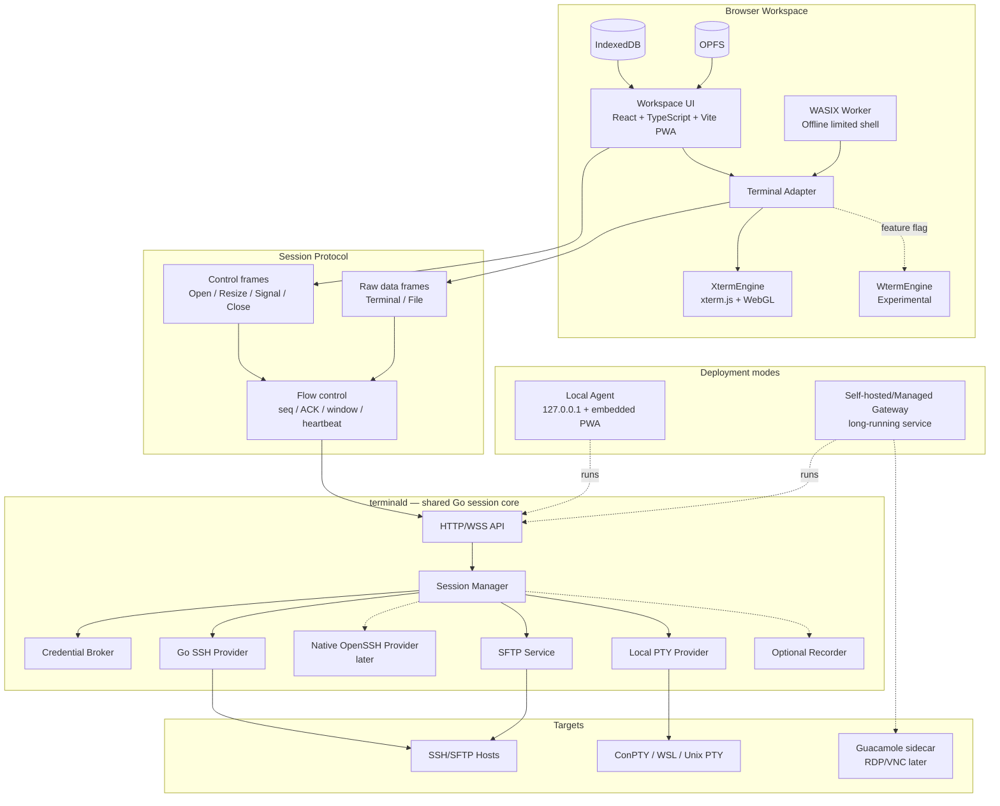
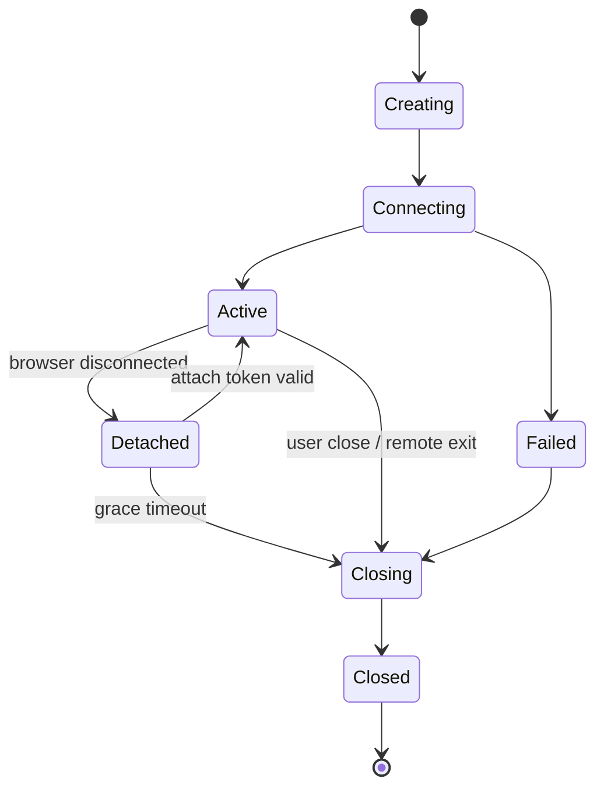

# 产品架构、协议与路线图

状态：Proposed

日期：2026-07-23

## 1. 产品定义

`oh_myssh` 是一个 local-first、web-native 的 SSH/SFTP 工作区。

核心用户：

- 同时管理多台 Linux、云服务器、NAS、路由器和开发板的个人开发者。
- 需要从 Windows、macOS、Linux、平板浏览器进入同一工作区的用户。
- 希望自托管，但不想部署完整企业 PAM 的小团队。

核心承诺：

- 快：大量输出、多个终端、分屏拖动和大目录浏览不能明显卡顿。
- 本地优先：断网后仍然能从 `localhost` 使用完整 SSH/SFTP 工作区。
- 安全：私钥默认留在系统钥匙串或 `ssh-agent`。
- 可迁移：终端、SSH 和远程桌面都通过 provider/adapter 接入。
- 可自托管：云端数据平面不是强制依赖。

## 2. 明确不是什么

- 不是在浏览器里重新实现完整 Linux。
- 不是企业堡垒机/PAM 的第一版替代品。
- 不是远程桌面产品优先。
- 不是 Electron 桌面客户端优先。
- 不是 AI Terminal 优先。
- 不是用 WASM 取代所有 JavaScript、Go 和系统能力。

## 3. 推荐架构



## 4. 为什么是这套技术

### 4.1 React + Vite，而不是先上 Next.js

应用的核心是持续运行的客户端工作区：

- 终端、分屏、拖动和 SFTP 都是浏览器状态。
- 本地 Agent 需要嵌入静态前端。
- 离线启动比 SSR 更重要。
- 登录、营销页面和云控制面以后可以独立部署。

因此第一版使用 React + TypeScript + Vite PWA。若以后官网或 SaaS 控制台需要 SSR，可建立独立应用，不污染终端工作区。

### 4.2 Go `terminald`

Go 适合：

- 长期 WebSocket 和 SSH 连接。
- 单文件跨平台发行。
- 并发 session、SFTP 和端口转发。
- 内嵌静态 PWA。
- 本地 Agent 与云端 Gateway 共用核心。

`terminald` 不是通用 TCP proxy。它只暴露显式允许的 SSH/SFTP/PTY 操作，缩小权限面。

### 4.3 xterm.js 默认，wterm 实验

`TerminalEngine` 是稳定边界：

```ts
export interface TerminalEngine {
  mount(container: HTMLElement): Promise<void>;
  write(data: Uint8Array): void;
  onInput(handler: (data: Uint8Array) => void): () => void;
  resize(cols: number, rows: number): void;
  focus(): void;
  serialize?(): Uint8Array;
  dispose(): void;
}
```

实现：

- `XtermEngine`：生产默认。
- `WtermEngine`：feature flag。
- `ReplayEngine`：测试与录屏回放。

React 只管理 terminal instance 的生命周期，不管理字节流。

## 5. 三种运行模式

### 5.1 浏览器离线模式

- Service Worker 已缓存应用后可离线启动。
- Wasmer WASIX Worker 运行受限工具。
- 不承诺连接任意 TCP/22。
- 不访问本机真实 PTY 和系统私钥。

适合演示、教学和轻量离线命令。

### 5.2 本地 Agent 模式

第一优先级。

```text
terminald --mode=local
  ├─ bind 127.0.0.1 only
  ├─ serve embedded web/dist
  ├─ same-origin WebSocket
  ├─ OS Keychain / ssh-agent
  ├─ ConPTY / WSL / Unix PTY
  └─ SSH/SFTP to LAN or Internet
```

为什么由 Agent 直接提供 PWA：

- 避免 HTTPS 页面连接 `ws://127.0.0.1` 的混合内容问题。
- 避免浏览器 Private Network Access 行为差异。
- 断网仍能冷启动。
- 前端和 Agent 可以使用一次性配对、同源 cookie 和严格 Origin。

### 5.3 云端 Gateway 模式

```text
Static PWA / Login / Control API
                  |
                  v
Long-running terminald Gateway
                  |
                  v
SSH/SFTP targets
```

- 静态 PWA 可以部署在 Vercel/CDN。
- 长期 SSH 会话部署在 VM、长驻容器或 Kubernetes。
- 用户应能选择自托管 Gateway。
- 托管 Gateway 在 MVP 后再增加。

## 6. `terminald` 模块边界

```text
cmd/terminald/
  main.go

internal/
  app/             mode wiring, lifecycle, configuration
  httpapi/         static files, REST control API, WebSocket upgrade
  transport/       frame codec, multiplexing, ACK, heartbeat
  session/         state machine, attach/detach, bounded replay
  provider/
    sshgo/         Go SSH provider
    openssh/       native OpenSSH provider, later
    localpty/      ConPTY / Unix PTY
    guacamole/     RDP/VNC, later
  sftp/            operations, chunked transfer, cancellation
  credentials/     keychain, ssh-agent, credential references
  knownhosts/      fingerprint verification and persistence
  recording/       optional event recording
  policy/          Origin, pairing, authorization, limits
  observability/   safe metrics and redacted logs
```

### Session 状态机



约束：

- 每个状态转换必须幂等。
- 任何失败必须产生稳定错误码。
- Detached 期间只保存有界 replay buffer。
- 真正长期 shell 保活通过 tmux/screen，而不是无限内存缓存。

## 7. 二进制会话协议

### 7.1 Frame

固定 16 字节 header：

```text
version:u8 | kind:u8 | flags:u16 | channel:u32 | seq:u32 | length:u32
```

规则：

- 网络字节序。
- `version` 不匹配时明确拒绝。
- `length` 在读取 payload 前先检查上限。
- 每个 `channel` 对应 terminal、SFTP request 或 transfer。
- 控制 payload 使用 Protobuf。
- terminal/file payload 使用原始 bytes。

### 7.2 消息

控制：

- `HELLO`
- `PAIR`
- `OPEN`
- `READY`
- `RESIZE`
- `SIGNAL`
- `ATTACH`
- `DETACH`
- `CLOSE`
- `EXIT`
- `ERROR`

流控：

- `ACK`
- `WINDOW_UPDATE`
- `PING`
- `PONG`

SFTP：

- `LIST`
- `STAT`
- `REALPATH`
- `MKDIR`
- `RENAME`
- `REMOVE`
- `CHMOD`
- `FILE_OPEN`
- `FILE_DATA`
- `FILE_ACK`
- `FILE_CLOSE`
- `CANCEL`

### 7.3 背压

- 单 terminal channel 初始窗口 256 KiB。
- 最大未确认窗口 512 KiB。
- 达到上限后 Gateway 暂停从 PTY/SSH 读取。
- Browser 使用累计 ACK。
- UI 卡住时不能让服务端缓冲无限增长。
- terminal 小包默认不压缩。
- 文件传输使用独立 channel；高吞吐时可使用独立 WebSocket。

### 7.4 重连

- 浏览器保存短期 opaque attach token。
- token 绑定 session、用户、Origin 和过期时间。
- 服务端保留有界序号窗口。
- 超出 replay 窗口后进行终端状态快照恢复，或提示重新 attach tmux。
- 不承诺像 Mosh 一样做预测回显；先保证正确性。

## 8. 凭据和 host key

### 8.1 浏览器只保存引用

```json
{
  "credentialId": "cred_local_01H...",
  "kind": "os-keychain",
  "label": "Home Ed25519",
  "publicFingerprint": "SHA256:..."
}
```

不得保存：

- 私钥正文。
- key passphrase。
- SSH 密码。
- 可重复使用的 Gateway 管理 token。

### 8.2 Credential Broker

本地模式：

- OS Keychain。
- `ssh-agent` / Windows OpenSSH Agent。
- 用户临时输入，仅保存在锁定内存的短生命周期对象中。

云端模式：

- 优先短期 SSH certificate。
- 其次用户自托管 Gateway。
- 长期私钥托管必须是显式、单独加密、可审计的高级选项。

### 8.3 Host key

- 首次连接显示算法和指纹。
- 用户明确接受后写入 Agent 的 `known_hosts`。
- host key 变化时 fail closed。
- UI 不能提供默认“忽略所有 host key”选项。

## 9. 前端边界

### 9.1 状态分类

React/Zustand：

- 主机树。
- tabs/splits。
- layout。
- 选中项。
- 设置和主题。
- transfer task 的可展示状态。

独立 session store：

- WebSocket。
- channel。
- seq/ACK。
- terminal instance。
- input/output queue。

IndexedDB：

- host profiles。
- workspaces。
- snippets。
- themes。
- credential references。
- known host 的展示缓存。

OPFS：

- 大型临时下载。
- session recording。
- 离线导出包。
- 可恢复传输片段。

### 9.2 性能规则

- terminal bytes 不进入 React state、Context 或 Redux action。
- `write()` 以小时间窗或 `requestAnimationFrame` 合并。
- 隐藏 tab 暂停 renderer，但仍受流控约束。
- SFTP 大目录使用虚拟列表。
- split resize 合并后发送，不逐像素发远端 resize。
- WASM、录屏编码、目录搜索放入 Worker。
- Monaco、Guacamole、AI 等非核心包延迟加载。

## 10. 数据模型

MVP 最小实体：

```text
Host
  id, name, address, port, username, groupId
  provider, proxyJumpIds[], credentialRef

HostGroup
  id, name, parentId, order

CredentialRef
  id, kind, label, publicFingerprint

Workspace
  id, name, layoutTree, tabs[], lastOpenedAt

Snippet
  id, name, command, tags[], scope

KnownHost
  host, port, algorithm, fingerprint, acceptedAt

TransferTask
  id, sessionId, direction, localPath, remotePath
  bytesDone, bytesTotal, state, errorCode
```

不要把运行中 Session 整体持久化到 IndexedDB。持久化的是可重建描述和短期 attach 信息。

## 11. 仓库结构

```text
oh_myssh/
  apps/
    web/
      src/
        app/
        workspace/
        terminal/
        hosts/
        sftp/
        settings/
        stores/
        workers/
  cmd/
    terminald/
  internal/
    app/
    httpapi/
    transport/
    session/
    provider/
    sftp/
    credentials/
    knownhosts/
    recording/
    policy/
    observability/
  packages/
    ui/
    terminal/
    workspace/
    storage/
    protocol-web/
  proto/
    terminal/v1/
  tests/
    vt-fixtures/
    protocol/
    e2e/
    security/
  deploy/
    docker/
    systemd/
    windows-service/
  docs/
```

工具：

- 前端：pnpm workspace。
- Go：单 `go.mod`，避免过早拆多个 module。
- Schema：Buf + Protobuf。
- E2E：Playwright。
- Go integration：真实 OpenSSH container。
- CI：Windows、Linux、macOS 分平台测试。

## 12. 路线图

时间仅作为一个 1–2 人核心团队的规划参考，不是交付承诺。

### Phase 0：技术尖峰，1–2 周

交付：

- `TerminalEngine` 接口。
- xterm/wterm 双实现最小 demo。
- VT 回放与性能测试夹具。
- Go PTY -> binary WebSocket -> browser vertical slice。
- Windows ConPTY/WSL 探针。

退出条件：

- xterm 通过 CJK/IME/tmux/vim/mouse/resize。
- wterm 风险有量化结果。
- 持续输出时未确认缓冲有上限。
- terminal bytes 没有进入 React state。

### Phase 1：本地 SSH vertical slice，3–5 周

交付：

- `terminald --mode=local`。
- 嵌入式 PWA。
- 主机创建、快捷连接。
- SSH password/key/agent。
- host key 确认。
- 单终端、resize、复制粘贴、重连。

退出条件：

- Windows/macOS/Linux 至少各能启动 Agent。
- 断开互联网后可冷启动并连接局域网 SSH。
- host key 变更会阻止连接。
- 私钥不出现在浏览器存储与 WebSocket 抓包中。

### Phase 2：工作区与 SFTP MVP，4–6 周

交付：

- tabs/splits。
- 主机树和分组。
- workspace 恢复。
- 命令片段。
- 双栏 SFTP。
- 上传、下载、取消、冲突确认和进度。
- 设置、主题、快捷键。

退出条件：

- 20 个已打开会话时 UI 仍可操作。
- 大目录列表虚拟化。
- 文件传输不会阻塞按键回显。
- 浏览器刷新后可重新 attach 或给出明确失效状态。

### Phase 3：MVP 加固与首个发布，3–5 周

交付：

- 自动升级与数据迁移。
- 安全检查和 threat model。
- 协议 fuzz/上限测试。
- Playwright E2E。
- Windows 服务、systemd 和 macOS launchd 包装。
- 文档、安装包和签名流程。

退出条件：

- 无 P0/P1 安全问题。
- CJK/IME/宽字符回归通过。
- 主要错误均有稳定错误码。
- 离线、升级、降级和卸载行为明确。

### Phase 4：自托管 Gateway，4–8 周

交付：

- `terminald --mode=server`。
- Docker 部署。
- 用户登录和 Gateway registration。
- 加密配置同步。
- session attach/detach。
- tmux 集成。
- SSH tunnel。

暂不自动加入：

- 强制录屏。
- 复杂团队 RBAC。
- SSO。
- 托管私钥。

### Phase 5：扩展

- Guacamole RDP/VNC。
- 团队、RBAC、SSO、审计。
- 短期 SSH certificate。
- 串口/Telnet provider。
- 设备发现。
- AI 助手，必须是显式 opt-in。

## 13. 第一批工程任务

建议按以下顺序建立 issues：

1. Scaffold pnpm + Go monorepo。
2. 定义 `TerminalEngine`。
3. 建立 VT fixture corpus。
4. xterm.js/WebGL demo。
5. wterm compatibility spike。
6. 定义 protocol v1 envelope。
7. 实现 Go frame codec 与上限测试。
8. 实现 browser frame codec。
9. 实现 Unix PTY provider。
10. 实现 Windows ConPTY provider。
11. 实现 session state machine。
12. 实现 ACK/window backpressure。
13. 嵌入 Vite build 到 `terminald`。
14. 实现 local pairing 和 Origin policy。
15. 实现 Go SSH provider。
16. 实现 known_hosts。
17. 实现 OS Keychain credential reference。
18. 实现 `ssh-agent` provider。
19. 实现 Host/Workspace IndexedDB repositories。
20. 实现 SFTP list/stat/read/write vertical slice。

不要在这些任务完成前开始 RDP/VNC、团队 SaaS 或 AI。

## 14. 质量门槛

### 终端兼容

- CJK 输入法组合输入。
- emoji 和双宽字符。
- combining characters。
- tmux、vim、nano、less、top、htop。
- bracketed paste。
- mouse tracking。
- alternate screen。
- resize 和 scrollback。
- 复制、粘贴和搜索。

### 性能

- 本地处理增加的键盘回显延迟 p95 小于 8 ms，不包含目标网络 RTT。
- 浏览器 terminal 未确认窗口不超过 512 KiB。
- 持续输出时不存在数秒主线程冻结。
- SFTP 文件传输不会饿死 terminal channel。
- 隐藏 tab 不进行无意义的全速绘制。

### 安全

- loopback only 默认。
- 严格 Origin。
- 一次性配对 token。
- host key fail closed。
- frame length/channel/rate 上限。
- 日志和 crash report 脱敏。
- recording 默认关闭。
- 私钥不进入浏览器和普通日志。

### 离线

- 无互联网冷启动。
- 本地字体、主题和 WASM 都已缓存或内嵌。
- Service Worker 更新失败时可回退。
- IndexedDB schema 可迁移。

## 15. 主要风险

| 风险 | 影响 | 应对 |
|---|---|---|
| wterm 兼容性不足 | 中文、tmux、vim 使用失败 | xterm 默认，适配层隔离 |
| React 误入热路径 | 输出卡顿、内存膨胀 | 独立 session store 和性能测试 |
| WebSocket 无背压 | OOM、会话失控 | 应用层 ACK/window |
| Go SSH 不覆盖 OpenSSH 全功能 | FIDO/ProxyCommand 不兼容 | provider 抽象，后续 Native OpenSSH |
| 浏览器连 localhost 限制 | Hosted PWA 无法稳定连 Agent | Agent 直接提供同源 PWA |
| 私钥托管扩大风险 | 高价值攻击面 | 本地 keychain/agent 优先 |
| 首版范围失控 | 无法形成可靠 MVP | 明确延后 RDP/VNC/PAM/AI |
| 大型 fork | 升级与许可证失控 | 绿地核心 + 小型依赖 |

## 16. 仍需仓库所有者确认

开始编码前只剩三个产品级决策：

1. 正式产品名是否继续使用 `oh_myssh`。
2. 许可证选择 Apache-2.0 还是 AGPL-3.0。
3. 首个公开版本是否只承诺 Local Agent，还是同时承诺 Self-hosted Gateway。

技术上推荐：

- 名称暂时保留。
- 优先评估 Apache-2.0。
- 第一个公开版本只承诺 Local Agent；Self-hosted Gateway 紧随其后。
