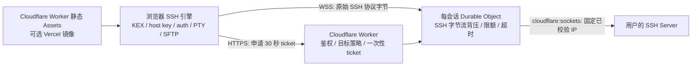

# 当前已实现架构

状态：本地协议互操作、构建与浏览器 UI 已实现并验证；推荐使用同一 Cloudflare Worker
托管 UI 与 relay，公网 Worker → 真实 VPS 仍需按目标服务器验收
更新：2026-08-01

## 数据路径

纯 Workers 部署下，页面、ticket API、WebSocket relay 和 Durable Objects 来自同一个
origin；Vercel 仍可作为静态镜像，但不承担 SSH 运行时。Cloudflare Worker 只负责
原始 TCP 中继，不终止或解密 SSH。它可见客户端 IP、目标地址、访问
令牌、流量时序、SSH identification/KEX 等传输元数据和原始协议字节；SSH 密码、
私钥、主机密钥判断和 SFTP 数据解释都在浏览器端完成，KEX 后的认证与会话内容
保持端到端加密。

## 已实现的安全边界

- `ACCESS_TOKEN` 只用于申请中继 ticket；UI 仅把它保存在 `sessionStorage`。
- ticket 30 秒过期、一次消费，并放在 WebSocket subprotocol header，不进入 URL。
- Worker 同时解析全部 A/AAAA；任一结果是私网或保留地址时整次请求失败。
- TCP 连接使用已校验的具体 IP，不重新用 hostname 解析，避免常规 DNS rebinding。
- `ALLOWED_ORIGINS`、`ALLOWED_PORTS`、`ALLOWED_HOSTS`、每分钟 ticket 数、每 IP
  活跃会话数、单帧/队列/总字节、空闲和最长会话都有边界。
- 浏览器对 SSH host key 做严格 TOFU：首次和变化都暂停确认，只有接受后才保存；
  拒绝变化不会覆盖旧指纹。
- Worker 到浏览器使用逐帧 ACK 背压；浏览器到 Worker 使用串行 writer 和队列上限。
- Workers Assets 与可选的 Vercel 静态服务器设置 CSP、HSTS、frame deny、nosniff、no-referrer 等安全头。
- 已移除会接收明文 SSH 凭据并可拨任意目标的旧 Node WebSSH gateway。

## SSH 与文件能力

- Password 和保守的单密码 keyboard-interactive fallback。
- RSA/ECDSA PEM、加密 PKCS#8；未加密 OpenSSH Ed25519/RSA/ECDSA。
- PTY、交互 shell、窗口 resize、keepalive、同一会话内的 SFTP subsystem。
- SFTP v3：realpath、stat、列表、mkdir/rmdir、删除、重命名、上传和下载。
- 128 KiB 流式传输；下载直接写 OPFS；上传先写随机临时文件，成功后 rename。
- 多标签保活；分屏会创建第二条真实 SSH 连接，不再显示伪离线终端。

## 明确未承诺

- 生产 Worker 主动阻止私网/本机目标；开发期 Vite 本机 relay 才允许用户访问 LAN。
- 暂不支持 SSH agent、ProxyJump、端口转发、加密 OpenSSH 私钥和断点续传。
- 保存的主机只含元数据。密码和私钥不会持久化；下次点击主机会重新要求凭据。
- known-hosts 指纹是安全判断元数据，保存在当前 origin 的 localStorage；它不是私钥。
- OPFS 不可用时，SFTP 本地文件区明确报错，不会伪装上传或下载成功。

## 验证基线

`npm test` 包含真实本机 SSH server 互操作：KEX、host key、password、PTY、shell、
resize、SFTP v3 读写、目录和原子临时文件。Worker 另有目标策略/DNS/ticket 单测并
通过 Wrangler dry-run 打包。生产 `dist` 还必须经过真实 Chrome 的首屏、console、
弹窗、lazy chunk 和分屏检查。
