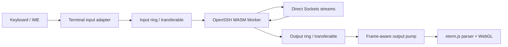

# 性能工程与验收基线

状态：Proposed，Phase 0 需要实测校准

基线日期：2026-07-23

## 1. 性能目标

Oh My SSH 的性能目标不是“跑分最高”，而是在真实远程工作中始终保持：

- 键盘跟手。
- terminal 输出无丢失、无错序。
- 多会话切换没有明显停顿。
- SFTP 大文件不会吃满内存或卡住 terminal。
- 长时间运行后性能不会持续退化。

所有延迟指标都排除公网 RTT；网络延迟必须单独展示，不能算作 UI 延迟。

## 2. 参考测试环境

每次 release 至少在以下三档环境运行相同 benchmark：

| 档位 | CPU/内存 | 显示 | 用途 |
|---|---|---|---|
| Baseline | 4 核、8 GiB | 1080p/60 Hz | 最低支持设备 |
| Reference | 8 核、16 GiB | 1440p/60 Hz | 发布门槛 |
| High refresh | 8 核以上、16 GiB | 1440p/120 Hz | 高频显示验证 |

测试报告必须记录 Chrome/Chromium 版本、GPU、操作系统、IWA/PWA 形态、
cross-origin isolation、WebGL renderer 和 SharedArrayBuffer 是否启用。

## 3. 初始性能预算

这些是进入实现前的目标，Phase 0 必须用真实数据确认是否合理。

### 3.1 应用启动

| 指标 | Reference 目标 | 说明 |
|---|---:|---|
| 本地安装 warm app shell 可交互 | < 500 ms | 不加载 SSH WASM |
| cold app shell 可交互 | < 1,500 ms | IWA 本地包 |
| terminal chunk warm mount | < 200 ms | 创建并聚焦 pane |
| OpenSSH WASM warm ready | < 700 ms | 已缓存 artifact |
| OpenSSH WASM cold ready | < 2,500 ms | 首次加载与初始化 |
| UI shell JS | <= 450 KiB gzip | 不含 terminal/WASM |
| terminal lazy chunk | <= 600 KiB gzip | 含 xterm 必需 addons |
| OpenSSH runtime | <= 12 MiB compressed | 暂定，Phase 0 实测 |

WASM 与 terminal 必须 lazy load。打开主机列表、设置或离线数据时不应下载或实例化
OpenSSH runtime。

### 3.2 交互

| 指标 | 目标 |
|---|---:|
| UI input handler p95 | < 8 ms |
| 稳态 frame p95（60 Hz） | < 16.7 ms |
| 稳态 frame p95（120 Hz） | < 8.3 ms |
| steady-state long task | 不出现 > 50 ms |
| tab/pane 切换 p95 | < 100 ms |
| command palette 打开 p95 | < 80 ms |
| split resize 到 PTY resize | < 100 ms，末次值必达 |

远程 shell 是否回显受 RTT 和服务器负载影响。客户端必须分别测量本地输入处理、
socket write、远程回显三个阶段。

### 3.3 Terminal

- 5 MiB ANSI fixture 完整回放，无丢字、错序和 parser error。
- 100,000 行 burst 输出期间 UI 仍可接受用户取消、切换 tab 和打开诊断。
- 20 个连接 session、4 个可见 pane 时不持续产生 >50 ms main-thread task。
- scrollback 默认 10,000 行，可配置但有明确内存预估。
- resize storm 每秒最多向 runtime 发送 20 次，中间值可合并，末次值不可丢失。
- hidden pane 不执行无意义 paint，但继续有界解析并保持 SSH channel 流动。
- WebGL context lost 后自动切换 DOM renderer，并提示性能状态。

### 3.4 SFTP

- 1 GiB 上传和下载过程中不完整加载到 JS heap。
- 单传输默认内存 buffer <= 16 MiB；全局传输 buffer <= 64 MiB。
- 传输进度最多 10 Hz 更新 React 状态。
- terminal 与 SFTP 并行时，terminal input handler p95 仍小于 8 ms。
- 取消请求在 500 ms 内进入 cancelling 状态并最终释放 stream、file handle 和 channel。
- 100,000 文件目录采用分页/渐进读取和虚拟化，不创建同数量 DOM 节点。

### 3.5 Vault

- Argon2id 在 crypto Worker 中执行，主线程无 >50 ms 阻塞。
- Reference 设备解锁目标 500–1,000 ms。
- Baseline 设备解锁目标不超过 2,000 ms。
- 内存参数不低于 RFC 9106 的 64 MiB 低内存建议，除非设备实测无法满足；
  任何降级必须显式记录在 Vault header。
- 自动参数校准只能在首次创建 Vault 时发生，不能静默降低已有 Vault 的成本。

## 4. 热路径架构



热路径禁止：

- React re-render。
- JSON serialize/deserialize。
- UTF-16 字符串反复拼接。
- Redux/Zustand action。
- console logging。
- IndexedDB transaction。
- analytics event。

控制事件，如连接阶段、错误、title、exit status 和限频进度，使用独立小消息通道。

## 5. Worker 模型

### 5.1 SSH session worker

每个活动 SSH process 初期使用独立 Worker，获得：

- 故障隔离。
- 直接生命周期管理。
- 简单的 stdin/stdout 和 VFS 所有权。
- session 关闭时可确定释放。

Phase 0 测量单 Worker/WASM 内存后决定最大并发和是否需要 idle worker pool。
在没有数据前不共享一个 OpenSSH process 跨多个连接。

### 5.2 Crypto worker

Argon2id、恢复包加解密和大批量 re-encryption 使用独立 Worker。Vault 解锁结果
只返回 non-extractable `CryptoKey` 能力或最小必要 handle，不把主密钥传给 UI。

### 5.3 SFTP

首版允许 SFTP 与对应 SSH session 共 Worker，通过独立 SSH channel 运行。若目录
解码、校验或 OPFS 写入影响 shell，则把文件处理拆到专用 Worker，保留 channel
控制在 session worker。

### 5.4 WASIX

离线 Shell 使用独立 Worker 和独立 VFS，不与 OpenSSH WASM 共享运行时或全局状态。

## 6. 字节传递与背压

### 6.1 优先路径

1. IWA cross-origin isolated：SharedArrayBuffer 单生产者/单消费者 ring。
2. 支持 Transferable：复用 `ArrayBuffer` pool 并转移所有权。
3. 小型控制消息：structured clone。

不允许为每个网络 chunk 创建多个 `Uint8Array.slice()`。

### 6.2 Output pump

- 汇聚同一 frame 内的小 chunk。
- 默认每批 16–64 KiB，根据 xterm write completion 自适应。
- xterm backlog 超过高水位时暂停从 ring 读取。
- backlog 回落到低水位后恢复。
- 不能在背压时丢弃 SSH stdout。
- 若隐藏 session 长时间大输出导致内存压力，降低解析频率并限制 scrollback，
  但仍保持协议流动；极端情况下向用户显示“输出已截断”的明确状态。

### 6.3 Input

- `onData` 和 `onBinary` 分开处理。
- IME composition 期间不得提前发送中间字符。
- bracketed paste 大文本分块发送，提供粘贴警告和取消。
- password prompt 输入不得进入历史、日志或广播通道。

## 7. React 与布局性能

- session runtime 对象保存在 registry，不放入 React state。
- selectors 必须细粒度，主机状态变化不能重渲染所有 terminal pane。
- split tree 使用稳定 node id 和结构共享。
- resize 使用 `ResizeObserver`，通过 `requestAnimationFrame` 合并。
- 主机列表、SFTP 目录、命令历史使用虚拟列表。
- tooltip、menu 和 inspector 按需挂载。
- 图标按模块导入，不导入完整 icon index。
- 大型设置页和离线 Shell 独立 lazy chunk。

## 8. Terminal renderer 策略

### 8.1 默认

xterm.js 6 + `@xterm/addon-webgl`：

- WebGL2 可用时启用。
- renderer 初始化失败或 context lost 时切换 DOM。
- fit/search/serialize 按 pane 生命周期加载。
- image、ligatures 和 experimental grapheme addon 默认关闭，单独 benchmark 后开启。

### 8.2 字体

- 字体全部本地打包。
- terminal 等待关键 mono 字体 ready 后再做第一次 fit。
- CJK fallback 不打包超大字体全集，优先使用系统字体。
- 用户切换字体后清理 glyph atlas 并重新测量 cell。
- ligatures 默认关闭。

### 8.3 wterm

wterm/Ghostty WASM 只有同时满足以下条件才能晋级：

- CJK 宽字符、IME、combining marks、emoji 全部通过。
- scrollback、alternate screen、mouse、selection 全部通过。
- 真实 SSH 高吞吐不低于 xterm.js reference。
- accessibility 不退化。
- 渲染器切换不会影响 SSH runtime 和 session model。

## 9. SFTP 数据路径

下载：

```text
SFTP packets
  -> SSH worker
  -> bounded ReadableStream
  -> OPFS sync access handle worker / user-selected writable
```

上传：

```text
File or OPFS handle
  -> bounded ReadableStream
  -> SSH worker
  -> SFTP channel
```

要求：

- 使用 BYOB reader 时必须验证浏览器支持并保留 fallback。
- checksum、预览、解压缩等非必要处理不在传输热路径。
- 传输速度使用滑动窗口计算，不为每个 chunk 写状态。
- 临时文件采用明确命名和完成后原子替换；取消后清理。
- OPFS 空间用 `navigator.storage.estimate()` 预检。

## 10. 存储性能

- IndexedDB 只保存结构化元数据和加密小记录。
- OPFS 保存加密 key blob、临时传输、录制和大型 runtime cache。
- OPFS 同步 access handle 只在 Worker 使用。
- 写操作通过 repository 层批量事务提交。
- workspace layout 变化 debounce 后持久化，但 `beforeunload` 不是唯一保存机制。
- 首次初始化请求 `navigator.storage.persist()`，失败时提示可能被浏览器清理。

## 11. Benchmark 工具

仓库需要固定以下 fixture：

```text
bench/
  fixtures/
    ansi-5m.bin
    ansi-cjk-ime.txt
    ansi-tmux-vim.bin
    long-lines.bin
    sftp-tree-100k.json
  browser/
    terminal-replay.spec.ts
    multi-session.spec.ts
    sftp-stream.spec.ts
    vault-kdf.spec.ts
  iwa/
    tcp-banner-smoke.ts
    ssh-login-smoke.ts
```

### 11.1 Terminal replay

- 以真实录制字节流而非生成纯文本测试。
- 测量输入 bytes、处理 bytes、完成时间、long tasks、dropped frames 和 heap delta。
- 输出结束后验证 buffer hash 或关键屏幕快照，证明没有丢失/错序。

### 11.2 真实 SSH

- CI/test fixture 可以运行 OpenSSH server；它不是产品运行时依赖。
- 测试 password、Ed25519、RSA、host key change、resize、signal 和 disconnect。
- 网络条件注入 latency、jitter、loss 和 bandwidth cap。

### 11.3 SFTP

- 1 MiB、100 MiB、1 GiB 三档。
- 单文件和 10,000 小文件分别测量。
- 同时运行 terminal output，观察交互 p95 和内存。

## 12. 观测与回归

仅在本地 benchmark 中采集：

- PerformanceObserver long task。
- frame interval。
- JS heap（浏览器允许时）。
- worker startup/terminate。
- xterm write backlog。
- ring buffer occupancy。
- socket/SFTP throughput。
- OPFS latency。

release PR 附带前后对比，超过以下任一条件即阻止合并：

- p95 延迟退化超过 10%。
- throughput 退化超过 10%。
- 峰值内存增加超过 15%。
- 新出现 >100 ms steady-state long task。
- terminal fixture hash 不一致。

## 13. 降级规则

- 无 WebGL：使用 DOM renderer，同时显示性能状态。
- 无 SharedArrayBuffer：使用 transferable buffer，不禁用 SSH。
- 无 OPFS：小文件可使用 IndexedDB/下载 API，大文件 SFTP 标记不支持。
- 无 persistent storage：允许使用，但持续提示导出恢复包。
- 页面不可见：暂停 paint 和非关键轮询，不关闭 SSH。
- memory pressure：减少 scrollback、缩略图和缓存；不得静默丢 terminal 输出。

降级必须是能力驱动且可诊断，不能用 user-agent 字符串猜测。

## 14. Phase 0 必须产出的数据

1. `ssh_client/wassh` WASM 和 JS artifact 的精确压缩/解压体积。
2. cold/warm compile 与 instantiate 时间。
3. 单 SSH session 的 worker、WASM、terminal 增量内存。
4. xterm WebGL 在 ANSI、CJK、tmux 和持续输出下的吞吐。
5. Direct Sockets read/write chunk 特征和背压行为。
6. 1、5、20 session 的 CPU/内存曲线。
7. 真实网络下从点击 Connect 到 shell prompt 的分段时间。
8. Chrome DevTools Direct Sockets trace 和可重复脚本。

这些数据完成后更新本文预算；不能只保留“高性能”形容词。
