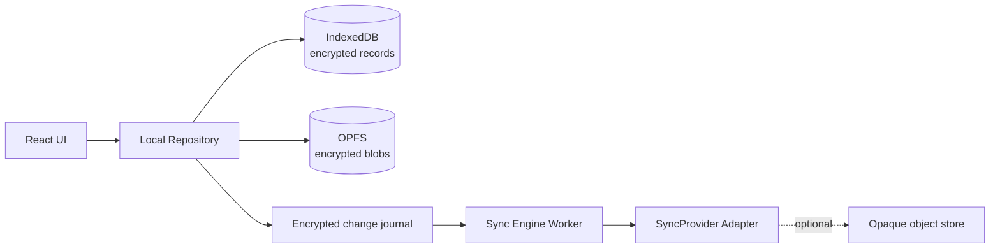

# 本地 Vault、端到端加密同步与安全边界

状态：Vault 进入 Phase 1；云同步只定义协议，Phase 5 才实现

基线日期：2026-07-23

## 1. 不可改变的安全边界

Oh My SSH 没有产品后端。未来可以增加可选云同步，但必须保持：

```text
Data plane
Browser -> Direct Sockets -> SSH/SFTP server

Control plane
Browser <-> encrypted sync objects <-> optional sync provider
```

同步服务：

- 不代理 SSH。
- 不持有 SSH session。
- 不接收 Vault 主密码。
- 不接收解密后的私钥或密码。
- 不接收 terminal 内容和远程文件。
- 服务中断时不影响本地连接能力。

如果未来某项功能必须让项目服务看到明文或参与 SSH 数据面，它必须作为不同产品
重新评审，不能悄悄并入“云同步”。

## 2. 数据分类

| 数据 | 本地存储 | 默认同步 | 可选同步 | 永不同步 |
|---|---|---:|---:|---:|
| UI 主题、快捷键、设置 | 加密记录 | ✓ | | |
| Host profile、分组、标签 | 加密记录 | ✓ | | |
| Workspace layout | 加密记录 | ✓ | | |
| Snippet | 加密记录 | ✓ | | |
| known_hosts | 加密记录 | | ✓ | |
| SSH password | Vault secret | | 明确授权 | |
| SSH private key | Vault secret/blob | | 明确授权 | |
| Vault 恢复材料 | 导出包 | | | ✓ |
| Terminal scrollback | 内存/可选本地录制 | | | ✓ |
| 命令历史 | 本地加密 | | 独立授权 | |
| SFTP 远程文件 | stream/本地临时区 | | | ✓ |
| 诊断日志 | 本地脱敏 | | | ✓ |

Secrets 同步必须使用独立开关，不能因为用户开启“同步设置”而自动上传私钥。

## 3. 本地优先模型

本地数据库永远是当前设备的事实来源：

1. 用户操作先写入本地加密事务。
2. UI 在本地事务成功后立即更新。
3. change journal 记录待同步 mutation。
4. 有同步 provider 且网络可用时异步 push/pull。
5. 冲突在本地解密后处理。

用户退出同步账号、服务离线或 token 过期时，本地数据继续完整可用。



## 4. Vault 密钥层级

### 4.1 创建

```text
User master password
  -> Argon2id(password, random salt, versioned parameters)
  -> Key Encryption Key (KEK)

crypto.getRandomValues()
  -> Vault Master Key (VMK, 256-bit)

KEK
  -> AES-256-GCM wrap with fresh IV and header AAD
  -> wrapped VMK stored in Vault header
```

主密码只用于解包随机 VMK。修改主密码只需重新 wrap VMK，不需要重新加密所有记录。

### 4.2 子密钥

使用 HKDF-SHA-256 和固定 context 做 domain separation：

```text
VMK
  ├── HKDF("ohmyssh/local-record/v1") -> Local Record Key
  ├── HKDF("ohmyssh/local-index/v1")  -> Local Index Key
  ├── HKDF("ohmyssh/export/v1")       -> Export Key
  └── wraps Sync Root Key when sync is enabled
```

不能在 record、index、export 和 sync 之间直接复用同一个 AES key。

### 4.3 Argon2id

- 使用 RFC 9106 Argon2id。
- 128-bit 随机 salt。
- 256-bit output。
- 初始下限采用 64 MiB、3 iterations 的低内存建议。
- 首次创建时在 crypto Worker 测量设备，目标 500–1,000 ms。
- 参数、实现版本和校准结果写入 Vault header。
- 解锁已有 Vault 时严格使用已记录参数，不静默降级。
- 参数升级创建新 header 并在成功验证后原子替换旧 header。

移动设备若无法分配当前参数，显示明确错误与恢复选项；不能把参数降到弱值后继续。

## 5. 本地记录格式

```ts
type VaultHeaderV1 = {
  format: "ohmyssh-vault";
  version: 1;
  kdf: {
    name: "argon2id";
    salt: string;
    memoryKiB: number;
    iterations: number;
    parallelism: number;
    outputBytes: 32;
  };
  wrapping: {
    algorithm: "AES-GCM";
    iv: string;
    wrappedVaultMasterKey: string;
  };
  createdAt: string;
};

type EncryptedRecordV1 = {
  id: string;
  schema: string;
  schemaVersion: number;
  cryptoVersion: 1;
  algorithm: "AES-GCM";
  iv: string;
  ciphertext: string;
};
```

AES-GCM AAD 包含：

```text
app-id | crypto-version | record-id | schema | schema-version
```

每次加密都生成新的 96-bit 随机 IV。禁止在同一 key 下重复使用 IV。批量 migration
生成新 ciphertext 后必须先完整验证，再替换旧记录。

## 6. Secret 生命周期

- 私钥导入后立即解析类型、指纹和加密状态。
- 原文件内容只在导入 Worker 的最短生命周期存在。
- 锁定 Vault 后终止持有解密材料的 Worker。
- OpenSSH session 需要私钥时，只挂载到该 session 的内存 VFS。
- session 结束即卸载并销毁 VFS。
- password 只传给对应认证 prompt，不进入 profile 普通字段。
- clipboard 导入需要用户手势；导入完成后提示用户主动清理剪贴板。
- JS/GC 无法保证绝对内存清零，文档必须诚实说明。

## 7. 自动锁定

触发条件可配置，但默认：

- 空闲 15 分钟。
- 设备锁屏/页面长时间隐藏。
- IWA window 全部关闭。
- 用户点击 Lock。
- 连续解锁失败超过策略阈值后退避。

锁定动作：

1. 停止 sync worker。
2. 终止 crypto worker。
3. 结束或要求用户选择是否结束现有 SSH session。
4. 卸载解密 VFS。
5. 清空敏感 UI 字段和临时对象引用。
6. 将应用切换为只显示非敏感壳层。

是否在锁定时断开 SSH 由安全策略决定，默认断开；不能让仍活动的 session 绕过
Vault 锁定语义。

## 8. 持久化与恢复

- 初始化时调用 `navigator.storage.persist()`。
- UI 显示当前 storage persistence 和 quota 状态。
- 浏览器仍可能在用户清除站点/IWA 数据时删除全部本地内容。
- 创建第一个 Identity 后强提示导出恢复包。
- 恢复包包含版本化、端到端加密的 Vault header 和选定记录。
- 恢复包密码必须与日常主密码不同或由用户明确确认复用风险。
- 导入恢复包先在临时数据库验证，成功后再合并。

## 9. 可选 WebAuthn PRF

WebAuthn PRF 可生成与 credential 绑定的 32-byte output，适合作为设备解锁材料。

采用方式：

- PRF 只用于 wrap/unwrap VMK 或设备 KEK。
- 主密码/恢复包路径始终保留。
- feature detection 失败时不创建无法恢复的数据。
- credential 删除、设备丢失和 authenticator 不可用必须有恢复流程。
- PRF output 不发送到同步服务。

它是便利解锁，不是同步账号本身。

## 10. 同步密钥层级

首次启用同步时在客户端生成随机 256-bit Sync Root Key（SRK），并由 VMK wrap。

```text
Sync Root Key
  ├── HKDF("ohmyssh/sync-record/v1") -> Sync Record Key
  ├── HKDF("ohmyssh/sync-index/v1")  -> Sync Index Key
  ├── HKDF("ohmyssh/sync-blob/v1")   -> Sync Blob Key
  └── HKDF("ohmyssh/device-link/v1") -> Device Link Key
```

远端 object id：

```text
base64url(HMAC-SHA-256(Sync Index Key, local record UUID))
```

这样 provider 不直接看到本地主机名称、record type 或 UUID。provider 仍能看到对象
大小、更新时间、设备网络信息和同步频率；这些 metadata 泄露必须公开说明。

## 11. 同步对象

```ts
type SyncEnvelopeV1 = {
  format: "ohmyssh-sync";
  version: 1;
  objectId: string;
  algorithm: "AES-GCM";
  iv: string;
  ciphertext: string;
};

type SyncPayloadV1 = {
  recordId: string;
  schema: string;
  schemaVersion: number;
  revision: string;
  deviceId: string;
  logicalTime: string;
  deleted: boolean;
  previousDigest?: string;
  deviceSignature: string;
  value?: unknown;
};
```

`objectId` 和密文之外的远端字段保持最少。revision、schema、设备 id、逻辑时间和
tombstone 都在密文内。

`deviceSignature` 对不含该字段的 canonical payload 签名。已授权设备公钥保存在
加密组状态中，用于验证 mutation 来源。传输完整性和并发控制使用 provider ETag；
不把明文 hash 或稳定内容 digest 暴露给 provider。

## 12. 冲突策略

不引入完整 CRDT runtime。当前数据规模小，类型已知，显式策略比通用 CRDT 更易
审计和恢复。

| 类型 | 策略 |
|---|---|
| Theme/settings | field-level last-writer-wins，使用 HLC + device id |
| Host profile | field-level merge；hostname/identity 冲突生成副本 |
| Snippet | whole-record merge；双写保留 conflict copy |
| Workspace split tree | whole-document LWW；loser 保存为 recovered workspace |
| known_hosts | 并集；同 host 不同 key 标记安全冲突，不自动覆盖 |
| Password/private key | 不自动合并；保留两个版本，要求用户选择 |
| Delete | tombstone，至少保留 90 天或直到所有已知设备确认 |

时钟使用 Hybrid Logical Clock，但不把客户端墙上时间当作唯一顺序。相同 HLC
使用稳定 device id 决胜，同时保留冲突副本。

## 13. SyncProvider 接口

Sync engine 只依赖不透明对象接口：

```ts
type RemoteObject = {
  key: string;
  etag: string;
  bytes: Uint8Array;
};

interface SyncProvider {
  readonly id: string;
  probe(signal?: AbortSignal): Promise<SyncCapabilities>;
  list(cursor?: string, signal?: AbortSignal): Promise<{
    objects: Array<{ key: string; etag: string }>;
    cursor?: string;
  }>;
  get(key: string, signal?: AbortSignal): Promise<RemoteObject | null>;
  put(
    key: string,
    bytes: Uint8Array,
    options: { ifMatch?: string; ifNoneMatch?: true },
    signal?: AbortSignal,
  ): Promise<{ etag: string }>;
}
```

首批 adapter：

1. `LocalOnlyProvider`：默认，不进行网络请求。
2. `WebDavProvider`：用户自带且正确配置 CORS 的 HTTPS WebDAV，使用
   ETag/If-Match。
3. `SelfHostedProvider`：未来公开的最小同步协议。
4. `OhMySshCloudProvider`：未来可选托管服务，与自建协议兼容。

provider token 存在独立加密记录中，不能与 SSH Identity 混合。
IWA 可以发起安全跨源请求，但 WebDAV 服务仍必须允许目标 origin 的 CORS；
不能承诺任意现有 WebDAV 地址都能直接使用。

## 14. 官方云端最小职责

未来若实现官方云端，只允许：

- 账号认证和设备列表。
- 存储 opaque encrypted objects。
- ETag/conditional write。
- 增量 cursor。
- 配额、限流和对象过期。
- 加密设备链接消息的短期转发。

禁止：

- 解密用户记录。
- 扫描 SSH 目标。
- 代表用户发起 SSH。
- 接收 terminal/SFTP stream。
- 在服务端执行用户 snippet。
- 把登录账号设为本地产品的强制前置条件。

## 15. 新设备加入

支持两个路径：

### 15.1 恢复密钥

- 旧设备生成高熵恢复密钥并离线展示。
- 恢复密钥 wrap SRK，不直接等于 SRK。
- 新设备下载 encrypted sync header 后本地解包。
- 恢复密钥不经过账号密码派生，不发送到 provider。

### 15.2 已有设备批准

- 新设备生成临时 X25519 key pair 和一次性二维码。
- 已解锁旧设备扫描并验证短码。
- 设备间通过 X25519 + HKDF 建立一次性加密通道。
- 旧设备传输 wrapped SRK 和设备策略。
- provider 最多转发无法解密的短期消息。

算法必须使用 WebCrypto Level 2 的标准能力，并保留 feature detection。正式实现前
需要独立密码学设计复核。

## 16. 设备身份与撤销

- 每个设备有独立 device id 和 WebCrypto Ed25519 签名 key；算法 id 写入
  versioned device record，便于未来迁移。
- 每个 mutation 由设备 key 签名，再由同步记录 key 加密认证。
- 用户可在任意已解锁设备撤销其他设备。
- 撤销阻止未来同步，但不能删除已经被该设备解密的数据。
- 怀疑设备泄露时轮换 SRK 并重新加密未来记录。
- 完整历史 re-encryption 是高成本显式操作，不在后台偷偷执行。

## 17. 威胁模型

### 17.1 要抵御

- 静态磁盘/IndexedDB/OPFS 被复制。
- 同步 provider 数据库泄露。
- provider 尝试篡改 ciphertext。
- 网络攻击者重放、截断或替换同步对象。
- 错误 host key 或 host key 变化。
- 未锁定设备的短时离开。
- 依赖或发布 artifact 被替换。

### 17.2 不能完全抵御

- 已控制的浏览器、操作系统或恶意扩展。
- Vault 已解锁时的 XSS/RCE。
- 用户主动粘贴私钥到恶意网页。
- 键盘记录器和屏幕录制恶意软件。
- 恶意 provider 拒绝服务、隐藏最新版本或回滚整个账户快照。
- JavaScript GC 导致的敏感内存残留。

客户端 hash chain、HLC 和已见 revision 可以发现部分回滚，但无法迫使恶意 provider
返回被其隐藏的数据。

## 18. Web/IWA 安全控制

- 签名 `.swbn`，发布 key 离线保护和轮换演练。
- IWA 强 CSP，额外使用 Trusted Types。
- 无远程 JavaScript、WASM、字体和动态插件。
- 所有可执行 artifact 固定 hash。
- 依赖 exact pin、lockfile、SBOM 和 provenance。
- 禁止 `eval`/`new Function`，WASM 只允许已打包模块。
- DOM 中不渲染远端 terminal 内容为 HTML。
- OSC 8 link 经过协议和 scheme allowlist。
- OSC 52 clipboard 默认需要用户批准。
- Direct Sockets 只能由明确连接操作触发，禁止网段扫描。
- 认证与 host key prompt 使用可信应用 chrome，不渲染在 terminal 字节流中。

## 19. 安全日志

本地安全事件可以记录：

- Vault lock/unlock 成败。
- Identity 创建、导入、导出和删除。
- host key 首次接受、变化和拒绝。
- 开启/关闭 secrets sync。
- 新设备加入、撤销和 key rotation。
- recovery package 创建/恢复。

事件中不包含密码、私钥、命令、terminal 内容、文件内容或完整 provider token。
日志默认本地加密且有保留期限。

## 20. 实施阶段

### Phase 1：Local Vault

- header/record format v1。
- Argon2id worker。
- VMK wrapping。
- AES-GCM per-record encryption。
- automatic lock。
- encrypted known_hosts 和 Identity。
- recovery package。

### Phase 3：Security release gate

- CSP/Trusted Types。
- signed bundle/provenance。
- SBOM/third-party notices。
- dependency audit。
- Vault threat model 和独立复核。

### Phase 5：Sync

- local change journal。
- encrypted envelope。
- LocalOnly/WebDAV adapter。
- conflict copies/tombstones。
- recovery-key device enrollment。
- secrets sync 独立授权。

### Phase 5.x：Managed cloud

- 最小 opaque object API。
- device approval。
- key rotation。
- self-hosted compatible server specification。

## 21. 安全验收

- 数据库和 OPFS 检查不到 host password/private key 明文。
- 错误主密码不会泄露记录是否包含特定 Identity。
- 每次记录写入使用新 IV，AAD 修改导致解密失败。
- lock 后无法从 UI、worker、VFS 或 repository 读取 secret。
- host key 变化阻止连接。
- provider 修改任何 byte 后客户端拒绝对象。
- 两设备并发修改产生确定结果和可恢复 conflict copy。
- provider 回放已见旧 revision 时客户端告警。
- 删除浏览器存储前用户收到恢复风险提示。
- 开启普通设置同步不会上传 Identity secret。
- 关闭同步或删除账号后本地 SSH 仍然完整可用。

## 22. 权威资料

- [RFC 9106：Argon2 Memory-Hard Function](https://www.rfc-editor.org/info/rfc9106/)
- [W3C Web Cryptography Level 2](https://www.w3.org/TR/WebCryptoAPI/)
- [W3C WebAuthn Level 3 / PRF extension](https://w3c.github.io/webauthn/)
- [MDN Origin Private File System](https://developer.mozilla.org/en-US/docs/Web/API/File_System_API/Origin_private_file_system)
- [MDN Persistent Storage](https://developer.mozilla.org/en-US/docs/Web/API/StorageManager/persist)
- [Chrome IWA security policies](https://developer.chrome.com/docs/iwa/developer-policy)

本文是工程设计，不构成密码学审计或法律意见。涉及正式同步发布前必须完成独立
安全评审。
